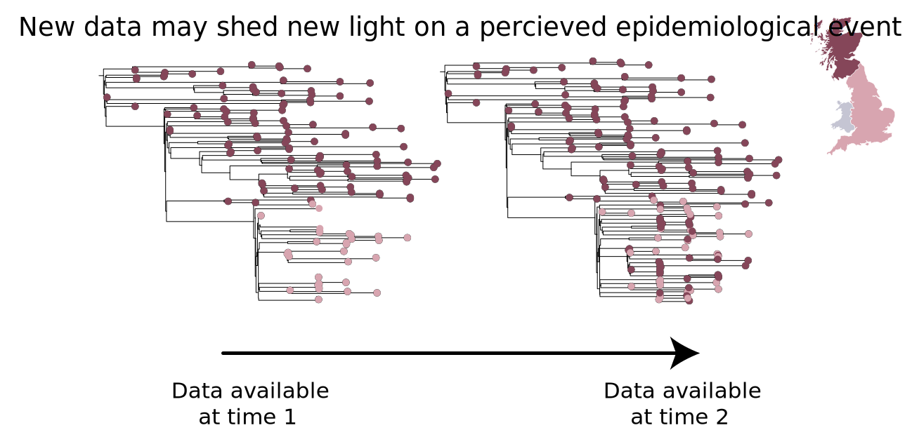

### Where do you find SNPs associated with a given lineage?

The model trains coefficients for each input parameter, for each potential lineage assignment. A particularly large coefficient in a particular lineage’s sigmoid function indicates a stronger association between that location and that lineage. A particularly negative coefficient in a particular lineage’s sigmoid function indicates the opposite. In other words, we can pick up SNPs that are strongly associated with or strongly negatively associated with a given lineage. This information is hosted for download from the [pangoLEARN](https://github.com/cov-lineages/pangoLEARN) data repository.

### Where does the data come from?

<strong>pangolin</strong> runs a multinomial logistic regression model trained against lineage assignments based on GISAID data.

Legacy <strong>pangolin</strong> runs using a guide tree and alignment hosted at [<strong>cov-lineages/lineages</strong>](https://github.com/cov-lineages/lineages.git). Some of this data is sourced from GISAID, but anonymised and encrypted to fit with guidelines. Appropriate permissions have been given and acknowledgements for the teams that have worked to provide the original SARS-CoV-2 genome sequences to GISAID are also hosted [here](https://cov-lineages.org/gisaid_acknowledgements.html).

### What support statistics are there?
<strong>Pre-pangolin 2.0:</strong>

Of 9,843 GISAID sequences assigned lineages by hand (taking sequence, phylogeny and metadata into account), pangolin accurately assigns the lineage of 97.85% of those sequences. Of the sequences that were not recalled correctly, 74.5% had 0 bootstrap and 0 alrt. We're continuing to work to improve this recall rate, but recommend interpreting the pangolin output cautiously with due attention to the UFbootstrap and aLRT values. 

Given SARS-CoV-2 is relatively slow evolving for an RNA virus and there is still not a huge amount of diversity, missing or ambiguous data at key residues may lead to incorrect placement within the guide tree. We have a filter in place that by default with not call a lineage for any sequence with >50% N-content, but this can be made more conservative with the command line option `--max-ambig`.

<strong>pangolin 2.0 onwards:</strong>

Recall and supporting statistics, hosted [here](https://github.com/cov-lineages/pangoLEARN/blob/master/pangoLEARN/data/lineagerecalls.txt), were generated using the same procedure as above to train a model using 75% of the data, while 25% of the data was used as testing data. Smaller lineages may have lower recall rates due to the very small sample sizes in the training and test set.

### Why might a lineage designation change?

A lineage designation is made taking the genome sequence data and associated epidemiological data into account. As different labs from different countries around the  world are producing data at different rates, we may only have part of the picture at a given time point when lineages are designated. The example schema below doesn't reflect a real lineage, but aims to demonstrate this exact situation. We see at time point 1 what looks like a clear geographic distinction, even potentially an introduction event from one location to another with evidence of onward spread reflected in the internal nodes within the pink clade. At time point 2, new data has come to light that shows the events may not be as straightforward as that. There doesn't appear to be a single introduction event, and it's even unclear whether there has been onward spread. This now no longer fits what we would describe as a lineage. This is a simple example, but shows how new data can change the narrative around a cluster of sequences.

