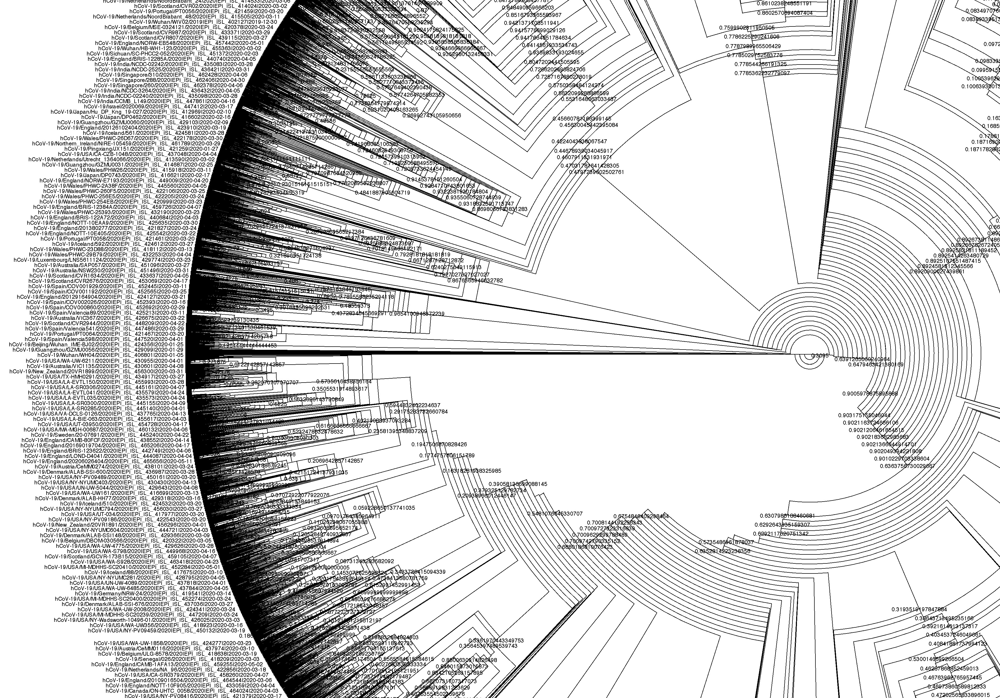

  <section id="banner">
    

      <header>
        <h1>Suggest a lineage</h1>
        
Add your sequences to the growing global lineage scheme

      </header>
      
As more and more labs across the world are contributing to the genomics effort and sequencing SARS-CoV-2 genomes, new lineages continue to be identified. We do regular updates of the lineage scheme, but acknowledge that data is being produced at a rate far faster than we are doing novel data releases!

    
 If you identify a set of sequences that are likely to be a new lineage, we invite you to submit them to be incorporated into the lineage scheme.

    
Follow the below guidelines to submit a new lineage to the scheme.

      <ul class="actions">
        <li><a href="https://github.com/cov-lineages/assignment" class="button special big">Suggest a lineage</a></li>
      </ul>
    

    
      
    
  </section>
  <section>
    

    <h2> What factors suggest your sequences form a new lineage?</h2>
    

        <ul>
            <li>Monophyly and cluster together on the global tree</li>
            <li>Convincing support values on the base node of the lineage (e.g. transfer bootstrap or ultrafast bootstrap)</li>
            <li>Epidemiological support (e.g. location, travel history)</li>
            <li>Introduction into a novel geographic region</li>
            <li>Evidence of circulation in that region (i.e. internal nodes within the lineage)</li>
            <li>A defining SNP</li>
        </ul>
        

    

    </section>

  <section>
    

    <h2> How to suggest a lineage:</h2>
    

    <ul>
        <li>Press the button:
        <ul class="actions">
        <a href="https://github.com/cov-lineages/assignment" class="button special small">Suggest a lineage</a>
        </ul></li>
        <li>Clone the assignment repository</li>
        <li>If your sequences are in GISAID, find them in the global tree if possible</li>
        <li>Submit a pull request to the repository with evidence showing evidence of a selection of the above factors. We recognise that with heuristic tree searching, homoplasy, compute limitations and availability of metadata all of the criteria above may not be fulfilled. Feel free to suggest lineages and provide as much information as is available and we will incorporate it into the global lineage scheme if possible.</li>
      </ul>
      
        

    

    </section>
