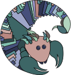

<section>
    <h1 style="text-align:right;"><strong>PANGO</strong> lineages</h1>
    

    

        <article>
            
            <h3>lineage description list</h3>
            
The latest Pango lineages 
            Daily updated information about currently circulating global lineages
            

        </article>
        <article>
            
            <h3>International lineage reports</h3>
            
<strong>grinch</strong> global report investigating novel coronavirus haplotypes B.1.1.7, B.1.351, P.1, B.1.617.2, A.23.1 and B.1.525 

        </article>
    

    

        <article>
            
            <h3>lineage assignment</h3>
            
<strong>pangolin </strong> Assign your CoV genomes a Pango lineage 
            

        </article>
        <article>
            
            <h3>constellation assignment</h3>
            
<strong>scorpio </strong> Assign your CoV genomes a constellation
            

        </article>
    

</section>
