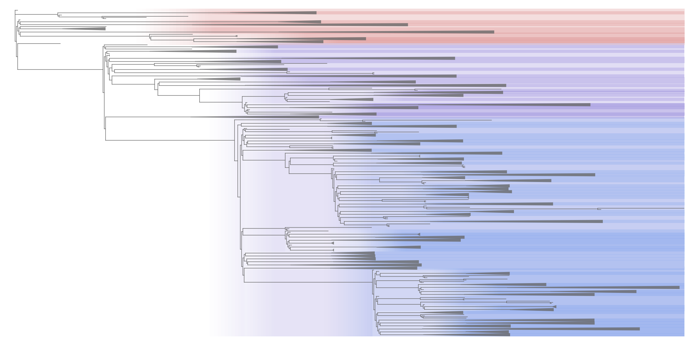

<!-- Section -->
<section>
    

        <h3>A dynamic nomenclature proposal for SARS-CoV-2 lineages to assist genomic epidemiology</h3>
        <a href="https://doi.org/10.1038/s41564-020-0770-5">Rambaut A, Holmes EC, O’Toole Á, Hill V, McCrone JT,  Ruis C, du Plessis L & Pybus OG (2020) <i>Nature Microbiology</i> DOI:10.1038/s41564-020-0770-5</a>

    

        <article>
            
            <h3>pangolin</h3>
            
<strong>Command line tool</strong> Assign your CoV sequences a global lineage
            

        </article>
		<article>
            
            <h3>llama</h3>
            
Local Lineage and Monophyly Assessment Add your sequences to the global tree (Coming soon)

        </article>
        <article>
            
            <h3>Global phylogeny of SARS-CoV-2</h3>
            
Phylogeny built and hosted by <a href="http://www.robertlanfear.com/"> Rob Lanfear Lab</a>
            

        </article>
        <article>
            
            <h3>Suggest new lineages</h3>
            
Add your sequences to the list of circulating global lineages

        </article>
        <!-- 

        
 -->
        <article>
            
            <h3>pangolin web</h3>
            
<strong>Web application</strong> Developed by the <a href="https://www.pathogensurveillance.net/">Centre for Genomic Pathogen Surveillance.</a>
            

        </article>
        <article>
            
            <h3>Lineage descriptions</h3>
            
More information about currently circulating global lineages

        </article>
    <!-- 

    
 -->
        <!-- <article>
            
            <h3>Lineage summary figures</h3>
            
More information about currently circulating global lineages

        </article> -->
    

</section>
