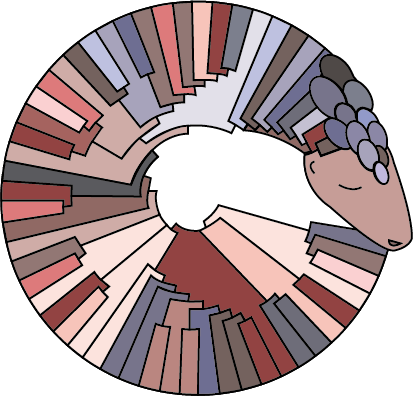

<!-- Section -->
<section>
	<!-- <header class="major">
		<h2>Ipsum sed dolor</h2>
	</header> -->
	

		<article>
			
			<h3>pangolin</h3>
			
Assign your CoV sequences a global lineage 
			Command line tool

			<!-- <ul class="actions">
				<li><a href="https://pangolin.cog-uk.io/" class="button">More</a></li>
			</ul> -->
		</article>
		<article>
			
			<h3>Assignment</h3>
			
Suggest new lineages

			<!-- <ul class="actions">
				<li><a href="#" class="button">More</a></li>
			</ul> -->
		</article>
		<article>
			
			<h3>pangolin web</h3>
			
Assign your CoV sequences a global lineage 
			Web application

			<!-- <ul class="actions">
				<li><a href="#" class="button">More</a></li>
			</ul> -->
		</article>
		<article>
			
			<h3>Lineage summary figures</h3>
			
More information about currently circulating global lineages

			<!-- <ul class="actions">
				<li><a href="#" class="button">More</a></li>
			</ul> -->
		</article>
	

</section>
