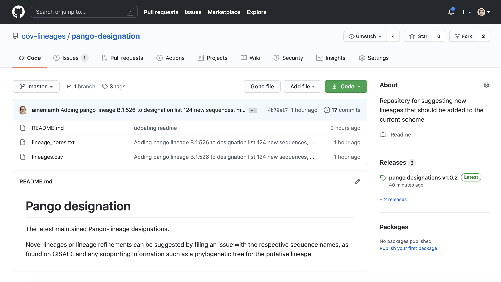
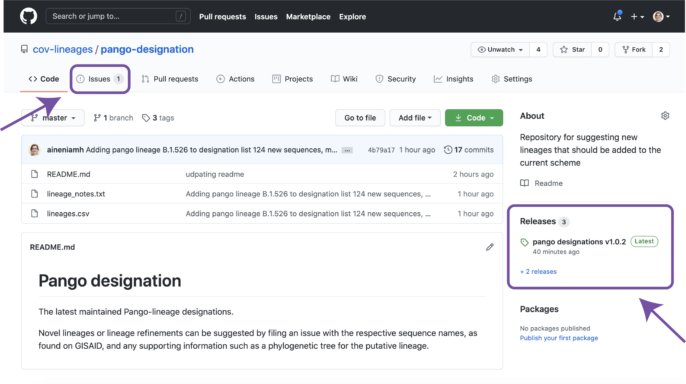
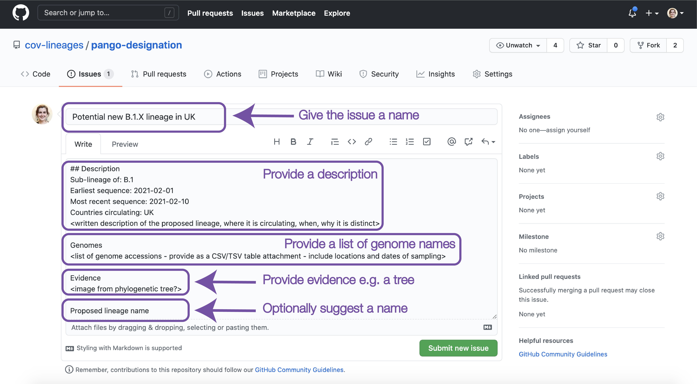

<section id="banner">

    <header>
    <h1>How to: lineage designation</h1>
    </header>
    
So you think you've identified a new lineage? The following is a step-by-step guide of how to add your new lineage to the growing list of lineages we maintain and can then be assigned using pangolin. 

    

</section>
<section>
    

    <h2>What to do</h2>
    <h3>1. Does your cluster fulfil the definition of a lineage?</h3>
    
Refer to the <a href="https://cov-lineages.org/pango_lineages.html" style="color:#7351A3">Pango lineage guide</a> to check if your cluster fits the new lineage guidelines.

    <h3>2. Navigate to the new pango-designation repository</h3>
    
Go to the  <a href="https://github.com/cov-lineages/pango-designation" style="color:#7351A3">github.com/cov-lineages/pango-designation</a> repository, shown below. Notice the lineage_notes.txt and lineages.csv files. These include the latest set of manually curated lineage designations.

    
    <h3>3. Check the current issues and releases</h3>
    
It may well be that others have also noticed this new lineage and have already requested it. It's a good idea to check the issues list and the latest tagged releases to ensure your new lineage doesn't already exist

    
    <h3>4. File a new issue in the repository</h3>
    
Use the <a href="https://github.com/cov-lineages/pango-designation/issues/1" style="color:#7351A3">example issue</a> to create a new issue describing why your cluster should be a new lineage and presenting evidence to support the lineage designation, potentially in the form of a phylogenetic tree. Note that your sequences need to be on GISAID to be added to the lineage scheme and you must provide a list of sequence names or GISAID IDs that we can match to the database. Ideally, sequences can be identified using the format consistent with the <a href="https://github.com/cov-lineages/pango-designation/lineages.csv" style="color:#7351A3">lineages.csv</a> file.

    
    

    <h2>What happens next</h2>
    
If your lineage proposal fits in with the lineage scheme, the following steps will take place:

    <h3>1. The lineage gets a name</h3>
    
A lineage name will be designated to your proposed lineage (or confirmed if you've suggested one). This name and your description will be added to the <a href="https://github.com/cov-lineages/pango-designation/lineage_notes.txt" style="color:#7351A3">lineage_notes.txt</a> file, and the sequence names you provide and the new lineage designation will be appended to the <a href="https://github.com/cov-lineages/pango-designation/lineages.csv" style="color:#7351A3">lineages.csv</a> file.

    <h3>2. A new pango-designation release is tagged</h3>
    
A new release will be tagged at <a href="https://github.com/cov-lineages/pango-designation" style="color:#7351A3">github.com/cov-lineages/pango-designation</a>. Small lineage updates will get a minor release tag, whereas more large-scale designations will get a major tag.

    <h3>3. pangoLEARN model training</h3>
    
This new set of designations will be input into the pangoLEARN training pipeline and run on the latest GISAID data. The information input is the sequence_name and the lineage designation. These will be matched up to the sequences on GISAID, so it is important for the correct names to be provided.

    
Issues we've encountered previously are different treatment of spaces in sequence names. For example on GISAID may output sequence name `South Africa/XXXXX/2020`, as spaces are not tolerated in fasta headers, our standard is to replace spaces with an underscore, creating `South_Africa/XXXXX/2020`. We have some checks in place in the pipeline for these edge cases, however please take case to avoid systematic changes to names that may unexpectedly interfere with our ability to match names to sequences.

    <h3>4. pangoLEARN data release</h3>
    
When the model completes training, the updated files are pushed to the <a href="https://github.com/cov-lineages/pangoLEARN" style="color:#7351A3">pangoLEARN</a> repository and a new pangoLEARN release is tagged. These new model files will be able to assign genomes similar to those in your new lineage that lineage designation. More information about how the pangoLEARN model training and assignment works can be found in the <a href="https://cov-lineages.org/pangolin.html" style="color:#7351A3">pangolin documentation</a>.

    <h3>5. Updates to the website</h3>
    
The information on the <a href="https://cov-lineages.org" style="color:#7351A3">cov-lineages.org</a> website is updated once daily, always with the latest designations and assignments. Within 24 hours you should be able to find your new lineage reflected on the website.

    

