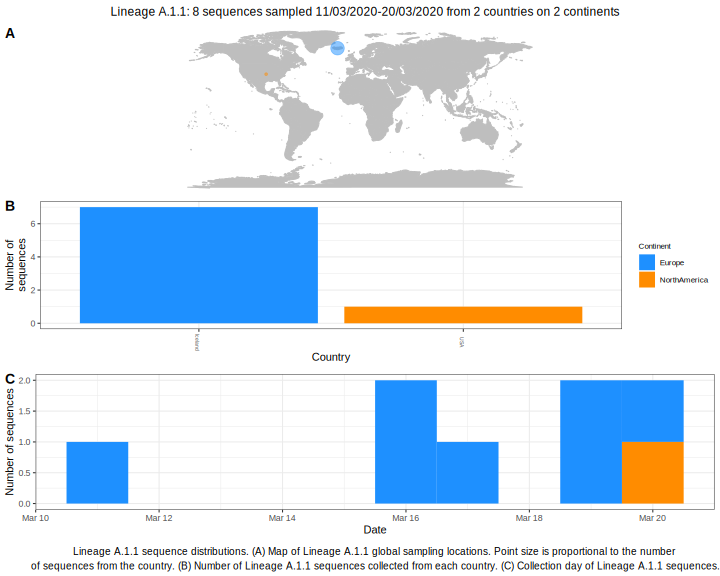

<ul class="actions small">
	 <a href="{{ 'lineages/lineage_A.1.html' | absolute_url }}" class="button special fit">Go to parent lineage: A.1</a>
</ul>

<h3> Lineage summaries</h3>

| Lineage name | Most common countries | Date range | Number of taxa | Known Travel | Recall value |
|:-----|:-----|:-------|-------:|-------:|:---------|--------:|
| <a href="{{ 'lineages/lineage_A.1.1.html' | absolute_url }}">A.1.1</a> | Iceland (88%), USA (12%) | March 11 to March 20 | 8 | USA to Iceland (6) | 0.88 |

<h3>Lineage descriptions</h3>

| Lineage | Notes |
|:-----|:-----|
| <a href="{{ 'lineages/lineage_A.1.1.html' | absolute_url }}">A.1.1</a> | Iceland lineage (BS=94) |

