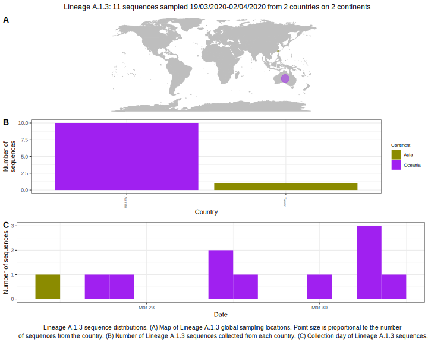

<strong>Lineage reassigned to parent lineage due to low support</strong>

<ul class="actions small">
	 <a href="{{ 'lineages/lineage_B.1.1.1.html' | absolute_url }}" class="button special fit">Go to parent lineage: A.1</a>
</ul>

<h3> Lineage summaries</h3>

| Lineage name | Most common countries | Date range | Number of taxa |  Days since last sampling | Known Travel | Recall value |
|:-----|:-----|:-------|-------:|-------:|:---------|--------:|

<h3>Lineage descriptions</h3>

| Lineage | Notes |
|:-----|:-----|
| <a href="{{ 'lineages/lineage_A.1.3.html' | absolute_url }}">A.1.3</a> | Previously Australian lineage, structure has split up into the diverity of A.1, so all reassigned A.1 |

