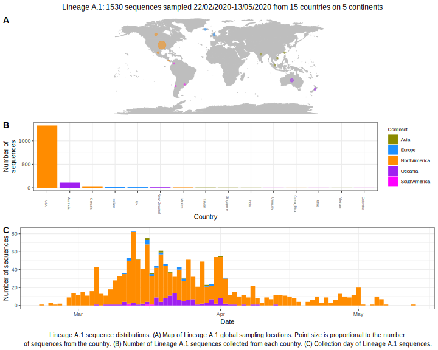

<ul class="actions small">
	 <a href="{{ 'lineages/lineage_A.html' | absolute_url }}" class="button special fit">Go to parent lineage: A</a>
</ul>

<h3> Lineage summaries</h3>

| Lineage name | Most common countries | Date range | Number of taxa |  Days since last sampling | Known Travel | Recall value |
|:-----|:-----|:-------|-------:|-------:|:---------|--------:|
| <a href="{{ 'lineages/lineage_A.1.html' | absolute_url }}">A.1</a> | USA (86%), Australia (7%), Canada (2%) | February 25 to July 14 | 987 |  | 0.99 |
| <a href="{{ 'lineages/lineage_A.1.1.html' | absolute_url }}">A.1.1</a> | Iceland (88%), USA (12%) | March 11 to March 20 | 8 | USA to Iceland (3) | 1.0 |

<h3>Lineage descriptions</h3>

| Lineage | Notes |
|:-----|:-----|
| <a href="{{ 'lineages/lineage_A.1.html' | absolute_url }}">A.1</a> | A North American lineage (BS=16) |
| <a href="{{ 'lineages/lineage_A.1.1.html' | absolute_url }}">A.1.1</a> | Iceland lineage (BS=94) |
| <a href="{{ 'lineages/lineage_A.1.3.html' | absolute_url }}">A.1.3</a> | Previously Australian lineage, structure has split up into the diverity of A.1, so all reassigned A.1 |

