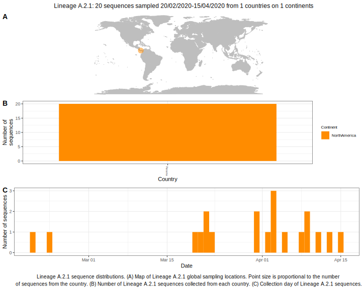

<ul class="actions small">
	 <a href="{{ 'lineages/lineage_A.2.html' | absolute_url }}" class="button special fit">Go to parent lineage: A.2</a>
</ul>

<h3> Lineage summaries</h3>

| Lineage name | Most common countries | Date range | Number of taxa |  Days since last sampling | Known Travel | Recall value |
|:-----|:-----|:-------|-------:|-------:|:---------|--------:|
| <a href="{{ 'lineages/lineage_A.2.1.html' | absolute_url }}">A.2.1</a> | Panama (97%), Spain (3%) | February 20 to July 04 | 78 |  | 0.92 |

<h3>Lineage descriptions</h3>

| Lineage | Notes |
|:-----|:-----|
| <a href="{{ 'lineages/lineage_A.2.1.html' | absolute_url }}">A.2.1</a> | Lineage with sequences predominantly from Panama |

