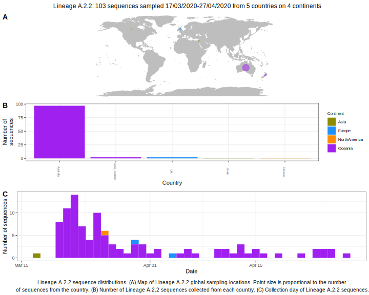

<ul class="actions small">
	 <a href="{{ 'lineages/lineage_A.2.html' | absolute_url }}" class="button special fit">Go to parent lineage: A.2</a>
</ul>

<h3> Lineage summaries</h3>

| Lineage name | Most common countries | Date range | Number of taxa |  Days since last sampling | Known Travel | Recall value |
|:-----|:-----|:-------|-------:|-------:|:---------|--------:|
| <a href="{{ 'lineages/lineage_A.2.2.html' | absolute_url }}">A.2.2</a> | Australia (92%), UK (6%), USA (1%) | March 17 to April 16 | 71 |  | 1.0 |

<h3>Lineage descriptions</h3>

| Lineage | Notes |
|:-----|:-----|
| <a href="{{ 'lineages/lineage_A.2.2.html' | absolute_url }}">A.2.2</a> | Australian lineage nested within the diversity of A.2 |

