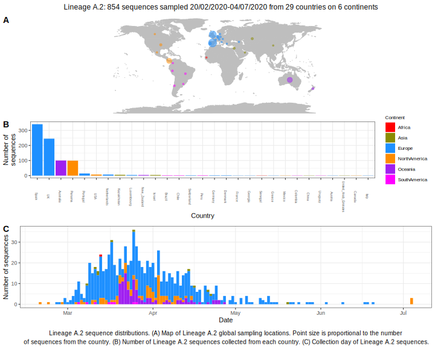

| Lineage | Notes |
|:-----|:-----|
| A.2 | Spain/ Chile/ Australia/ Europe (BS=93) |

<h2>Lineage A.2 composition summary </h2>

<strong>Total number of sequences:</strong> 295

| Lineage name | Most common countries | Date range | Number of taxa |  Days since last sampling | Known Travel | Recall value |
|:-----|:-----|:-------|-------:|-------:|:---------|--------:|
| A.2 | UK (34%), Spain (28%), Australia (28%) | February 26 to April 27 | 295 | 13 | Spain to Brazil (1)  Italy to Chile, Spain (2)  | 100.0 |
