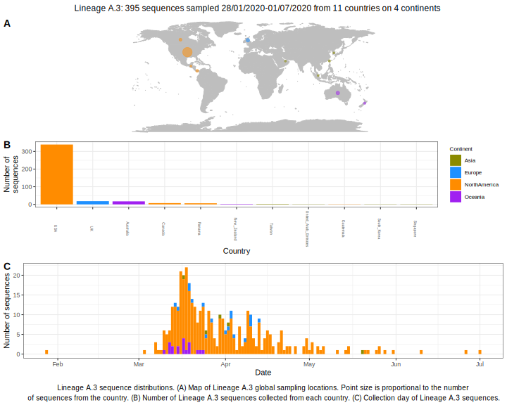

<ul class="actions small">
	 <a href="{{ 'lineages/lineage_A.html' | absolute_url }}" class="button special fit">Go to parent lineage: A</a>
</ul>

<h3> Lineage summaries</h3>

| Lineage name | Most common countries | Date range | Number of taxa | Known Travel | Recall value |
|:-----|:-----|:-------|-------:|-------:|:---------|--------:|
| <a href="{{ 'lineages/lineage_A.3.html' | absolute_url }}">A.3</a> | USA (82%), UK (7%), Australia (5%) | January 28 to July 01 | 332 | USA to New_Zealand (1) | 0.99 |

<h3>Lineage descriptions</h3>

| Lineage | Notes |
|:-----|:-----|
| <a href="{{ 'lineages/lineage_A.3.html' | absolute_url }}">A.3</a> | USA and Australian lineage  |

