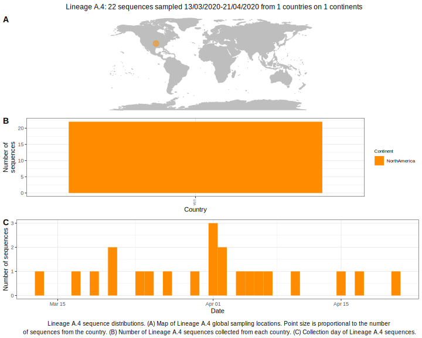

<ul class="actions small">
	 <a href="{{ 'lineages/lineage_A.html' | absolute_url }}" class="button special fit">Go to parent lineage: A</a>
</ul>

<h3> Lineage summaries</h3>

| Lineage name | Most common countries | Date range | Number of taxa |  Days since last sampling | Known Travel | Recall value |
|:-----|:-----|:-------|-------:|-------:|:---------|--------:|
| <a href="{{ 'lineages/lineage_A.4.html' | absolute_url }}">A.4</a> | USA (100%) | March 11 to April 10 | 33 | 116 |  | 1.000 |

<h3>Lineage descriptions</h3>

| Lineage | Notes |
|:-----|:-----|
| <a href="{{ 'lineages/lineage_A.4.html' | absolute_url }}">A.4</a> | Lineage circulating in USA (BS=100) |

