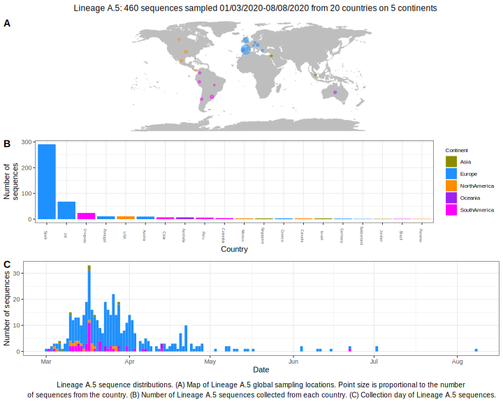

| Lineage | Notes |
|:-----|:-----|
| A.5 | A lineage with a lot of representation from Spanish-speaking countries. A majoritively Spain/ South-American lineage, lower bootstrap this week BS 87->20.  |

<h2>Lineage A.5 composition summary </h2>

<strong>Total number of sequences:</strong> 118

| Lineage name | Most common countries | Date range | Number of taxa |  Days since last sampling | Known Travel | Recall value |
|:-----|:-----|:-------|-------:|-------:|:---------|--------:|
| A.5 | Spain (39%), UK (35%), Uruguay (6%) | February 23 to April 26 | 118 | 14 |  | 95.93 |
