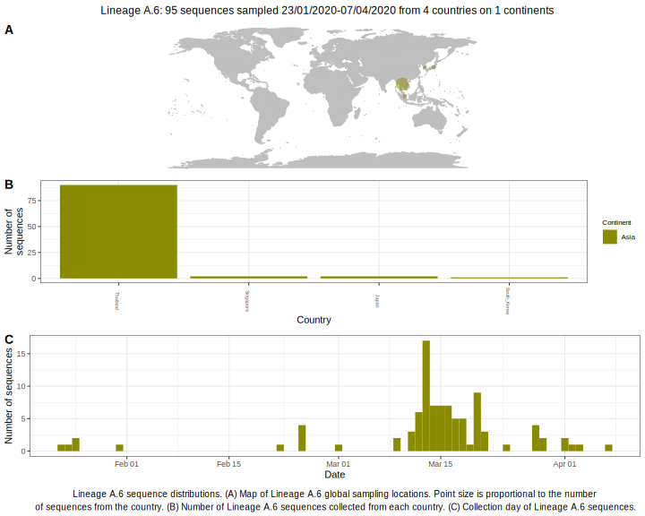

<ul class="actions small">
	 <a href="{{ 'lineages/lineage_A.html' | absolute_url }}" class="button special fit">Go to parent lineage: A</a>
</ul>

<h3> Lineage summaries</h3>

| Lineage name | Most common countries | Date range | Number of taxa |  Days since last sampling | Known Travel | Recall value |
|:-----|:-----|:-------|-------:|-------:|:---------|--------:|
| <a href="{{ 'lineages/lineage_A.6.html' | absolute_url }}">A.6</a> | Thailand (100%) | January 23 to March 28 | 31 | 43 |  | 100.0 |

<h3>Lineage descriptions</h3>

| Lineage | Notes |
|:-----|:-----|
| <a href="{{ 'lineages/lineage_A.6.html' | absolute_url }}">A.6</a> | Lineage in Thailand (BS=87) |

