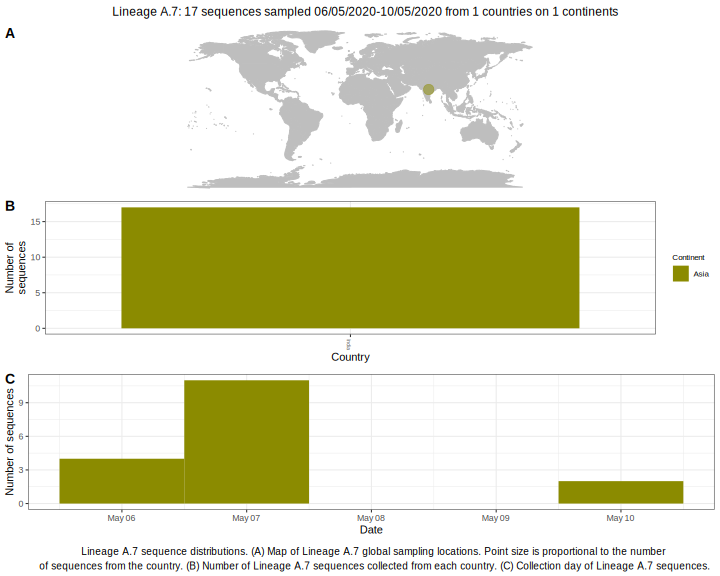

<ul class="actions small">
	 <a href="{{ 'lineages/lineage_A.html' | absolute_url }}" class="button special fit">Go to parent lineage: A</a>
</ul>

<h3> Lineage summaries</h3>

| Lineage name | Most common countries | Date range | Number of taxa |  Days since last sampling | Known Travel | Recall value |
|:-----|:-----|:-------|-------:|-------:|:---------|--------:|
| <a href="{{ 'lineages/lineage_A.7.html' | absolute_url }}">A.7</a> | India (100%) | May 06 to May 10 | 15 | 104 |  | 1.0 |

<h3>Lineage descriptions</h3>

| Lineage | Notes |
|:-----|:-----|
| <a href="{{ 'lineages/lineage_A.7.html' | absolute_url }}">A.7</a> | Indian lineage, including Saudi Arabian & Turkish sequences. A.7, A.8 and A.9 are all lineages with diversity from India, however are difficult to resolve confidently, potentially due to ambiguities or homoplasies in the sequences. All are nested within the diversity of A. |

