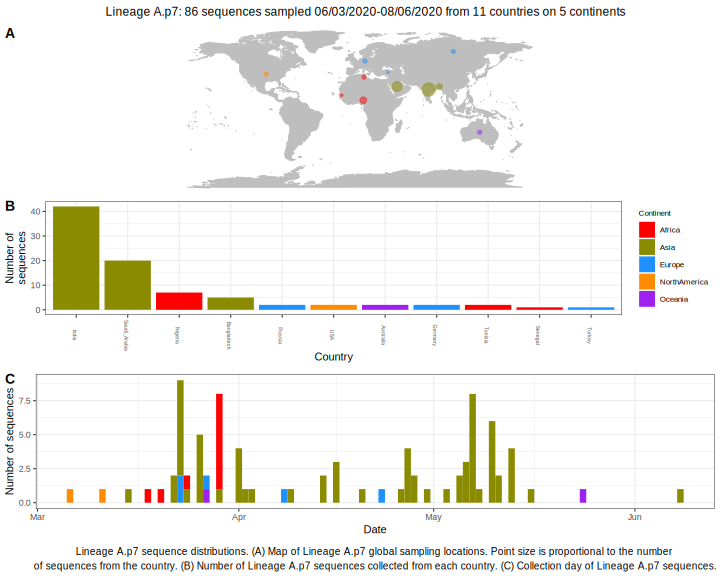

<h2> Lineage summaries</h2>

| Lineage name | Most common countries | Date range | Number of taxa |  Days since last sampling | Known Travel | Recall value |
|:-----|:-----|:-------|-------:|-------:|:---------|--------:|
| A.p7 | Saudi_Arabia (70%), USA (7%), Russia (7%) | March 06 to April 27 | 27 | 13 | Saudia_Arabia to Turkey (1)  | 100.0 |

<h2>Lineage descriptions</h2>

| Lineage | Notes |
|:-----|:-----|
| A.p7 | Potential lineage: Saudi Arabia, Russia, Turkey, India (BS=50) |

