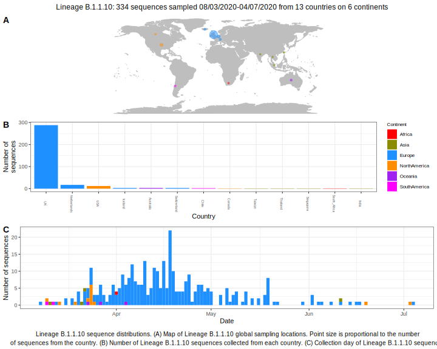

<ul class="actions small">
	 <a href="{{ 'lineages/lineage_B.1.1.html' | absolute_url }}" class="button special fit">Go to parent lineage: B.1.1</a>
</ul>

<h3> Lineage summaries</h3>

| Lineage name | Most common countries | Date range | Number of taxa |  Days since last sampling | Known Travel | Recall value |
|:-----|:-----|:-------|-------:|-------:|:---------|--------:|
| <a href="{{ 'lineages/lineage_B.1.1.10.html' | absolute_url }}">B.1.1.10</a> | UK (91%), USA (2%), Netherlands (2%) | March 06 to July 20 | 454 | USA to Iceland (1), UK to Iceland (1) | 0.98 |

<h3>Lineage descriptions</h3>

| Lineage | Notes |
|:-----|:-----|
| <a href="{{ 'lineages/lineage_B.1.1.10.html' | absolute_url }}">B.1.1.10</a> | Formerly UK/ Iceland, a lot of diversity in this lineage, now has a Turkish sequence.  |

