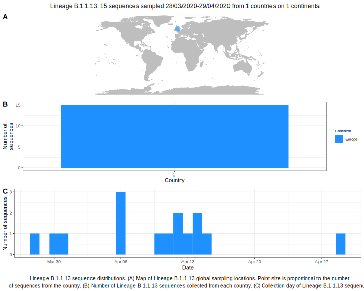

<h2> Lineage summaries</h2>

| Lineage name | Most common countries | Date range | Number of taxa |  Days since last sampling | Known Travel | Recall value |
|:-----|:-----|:-------|-------:|-------:|:---------|--------:|
| B.1.1.13 | UK (100%) | March 28 to April 15 | 16 | 25 |  | 100.0 |

<h2>Lineage descriptions</h2>

| Lineage | Notes |
|:-----|:-----|
| B.1.1.13 | Formerly B.1.61, UK lineage (BS=95) |

