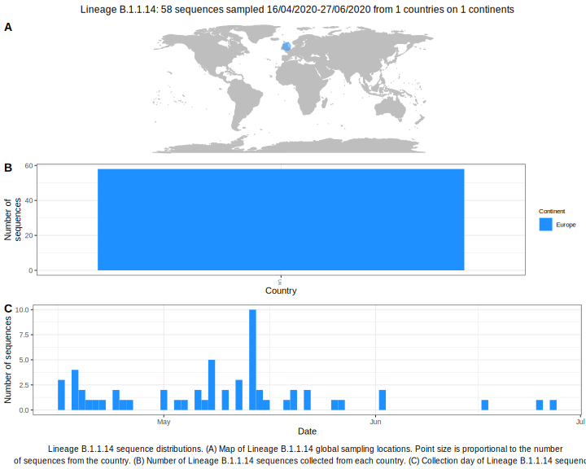

<ul class="actions small">
	 <a href="{{ 'lineages/lineage_B.1.1.html' | absolute_url }}" class="button special fit">Go to parent lineage: B.1.1</a>
</ul>

<h3> Lineage summaries</h3>

| Lineage name | Most common countries | Date range | Number of taxa |  Days since last sampling | Known Travel | Recall value |
|:-----|:-----|:-------|-------:|-------:|:---------|--------:|
| <a href="{{ 'lineages/lineage_B.1.1.14.html' | absolute_url }}">B.1.1.14</a> | UK (98%), Portugal (2%) | April 08 to June 17 | 61 | 48 |  | 0.800 |

<h3>Lineage descriptions</h3>

| Lineage | Notes |
|:-----|:-----|
| <a href="{{ 'lineages/lineage_B.1.1.14.html' | absolute_url }}">B.1.1.14</a> | Scottish lineage (BS=79) |

