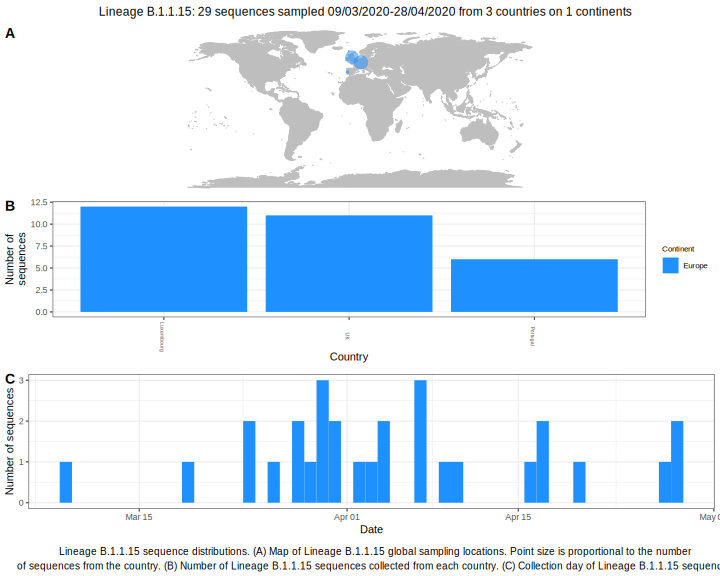

<ul class="actions small">
	 <a href="{{ 'lineages/lineage_B.1.1.html' | absolute_url }}" class="button special fit">Go to parent lineage: B.1.1</a>
</ul>

<h3> Lineage summaries</h3>

| Lineage name | Most common countries | Date range | Number of taxa |  Days since last sampling | Known Travel | Recall value |
|:-----|:-----|:-------|-------:|-------:|:---------|--------:|
| <a href="{{ 'lineages/lineage_B.1.1.15.html' | absolute_url }}">B.1.1.15</a> | Luxembourg (41%), UK (38%), Portugal (21%) | March 09 to April 28 | 29 | 55 |  | 0.000 |

<h3>Lineage descriptions</h3>

| Lineage | Notes |
|:-----|:-----|
| <a href="{{ 'lineages/lineage_B.1.1.15.html' | absolute_url }}">B.1.1.15</a> | Luxembourg lineage (BS=16, but internal nodes all 100) |

