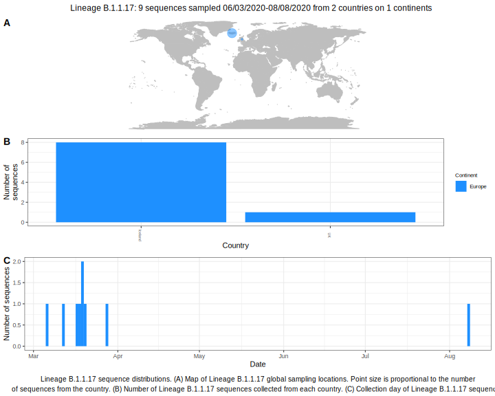

<h2> Lineage summaries</h2>

| Lineage name | Most common countries | Date range | Number of taxa |  Days since last sampling | Known Travel | Recall value |
|:-----|:-----|:-------|-------:|-------:|:---------|--------:|
| B.1.1.17 | Iceland (100%) | March 06 to March 28 | 29 | 43 | Italy to Iceland (1)  | 100.0 |

<h2>Lineage descriptions</h2>

| Lineage | Notes |
|:-----|:-----|
| B.1.1.17 | Formerly B.1.58, Iceland lineage (BS=100) |

