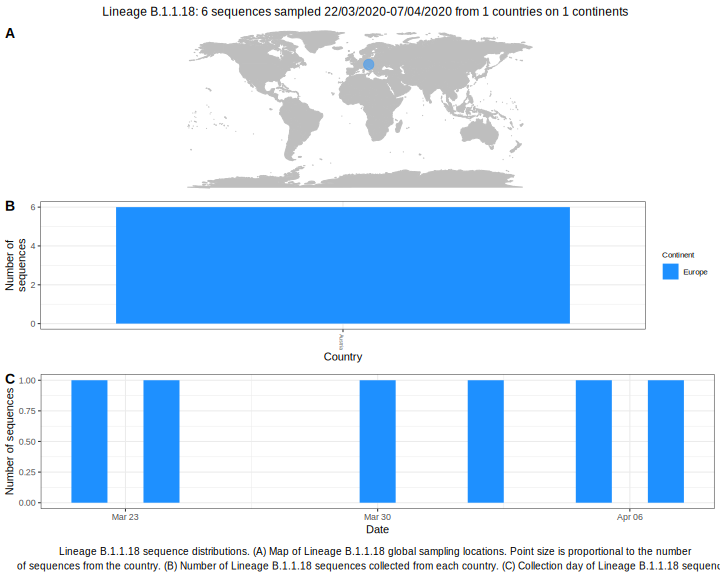

<h2> Lineage summaries</h2>

| Lineage name | Most common countries | Date range | Number of taxa |  Days since last sampling | Known Travel | Recall value |
|:-----|:-----|:-------|-------:|-------:|:---------|--------:|
| B.1.1.18 | Austria (100%) | March 22 to April 07 | 8 | 33 |  | 100.0 |

<h2>Lineage descriptions</h2>

| Lineage | Notes |
|:-----|:-----|
| B.1.1.18 | Formerly B.1.57, Austrian lineage (BS=97) |

