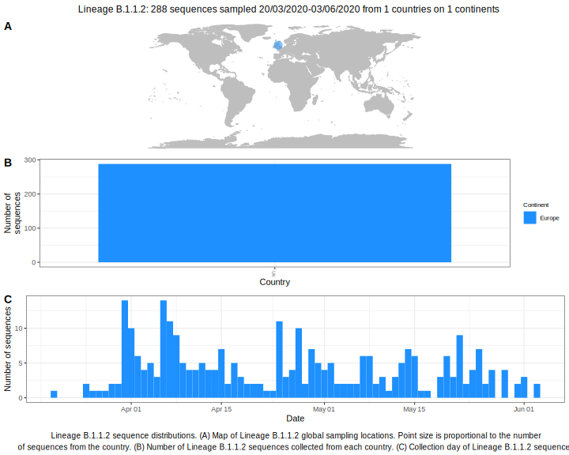

| Lineage | Notes |
|:-----|:-----|
| B.1.1.2 | Formerly B.1.24, Welsh lineage (BS=100->47 this week) |

<h2>Lineage B.1.1.2 composition summary </h2>

<strong>Total number of sequences:</strong> 107

| Lineage name | Most common countries | Date range | Number of taxa |  Days since last sampling | Known Travel | Recall value |
|:-----|:-----|:-------|-------:|-------:|:---------|--------:|
| B.1.1.2 | UK (100%) | March 20 to April 20 | 107 | 20 |  | 99.07 |
