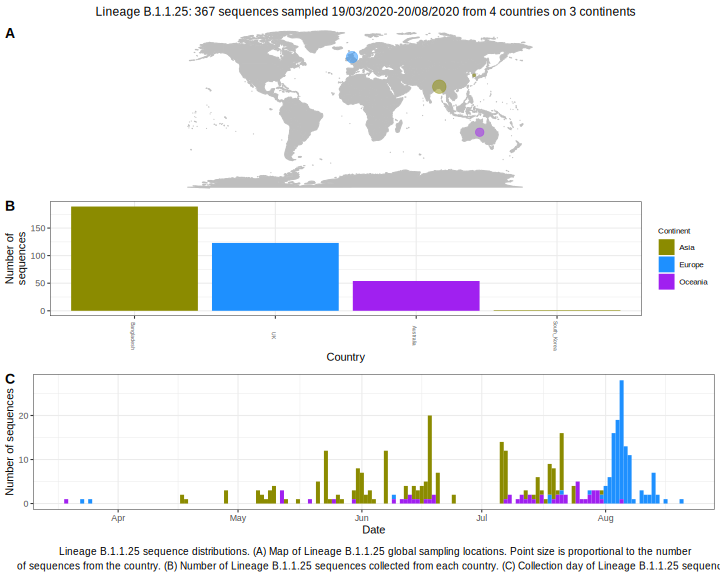

<ul class="actions small">
	 <a href="{{ 'lineages/lineage_B.1.1.html' | absolute_url }}" class="button special fit">Go to parent lineage: B.1.1</a>
</ul>

<h3> Lineage summaries</h3>

| Lineage name | Most common countries | Date range | Number of taxa | Known Travel | Recall value |
|:-----|:-----|:-------|-------:|-------:|:---------|--------:|
| <a href="{{ 'lineages/lineage_B.1.1.25.html' | absolute_url }}">B.1.1.25</a> | Bangladesh (52%), UK (36%), Australia (8%) | February 29 to October 07 | 368 |  | 0.31 |

<h3>Lineage descriptions</h3>

| Lineage | Notes |
|:-----|:-----|
| <a href="{{ 'lineages/lineage_B.1.1.25.html' | absolute_url }}">B.1.1.25</a> | Bangladesh lineage |
| <a href="{{ 'lineages/lineage_D.1.html' | absolute_url }}">D.1</a> | UK lineage (Alias of B.1.1.25.2) |
| <a href="{{ 'lineages/lineage_D.2.html' | absolute_url }}">D.2</a> | Australian lineage (Alias of B.1.1.25.1) |

