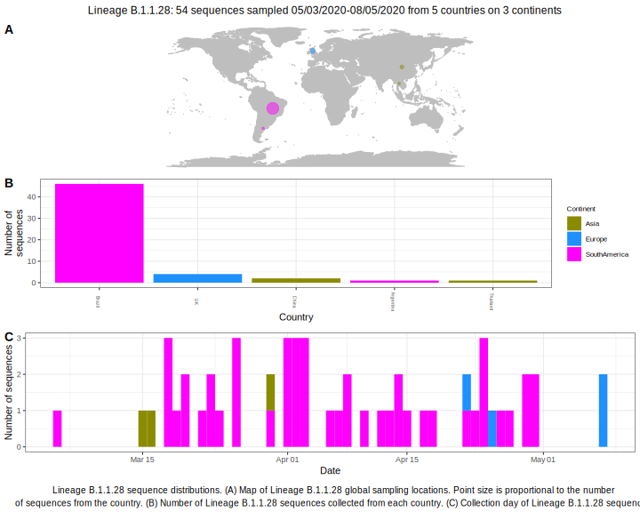

<ul class="actions small">
	 <a href="{{ 'lineages/lineage_B.1.1.html' | absolute_url }}" class="button special fit">Go to parent lineage: B.1.1</a>
</ul>

<h3> Lineage summaries</h3>

| Lineage name | Most common countries | Date range | Number of taxa | Known Travel | Recall value |
|:-----|:-----|:-------|-------:|-------:|:---------|--------:|
| <a href="{{ 'lineages/lineage_B.1.1.28.html' | absolute_url }}">B.1.1.28</a> | Brazil (81%), UK (12%), Australia (2%) | March 15 to October 13 | 206 |  | 0.99 |

<h3>Lineage descriptions</h3>

| Lineage | Notes |
|:-----|:-----|
| <a href="{{ 'lineages/lineage_B.1.1.28.html' | absolute_url }}">B.1.1.28</a> | Brazil lineage, some sister sequences from parent node are also from Brazil, however there's sequences from a variety of other locations on that node. |

