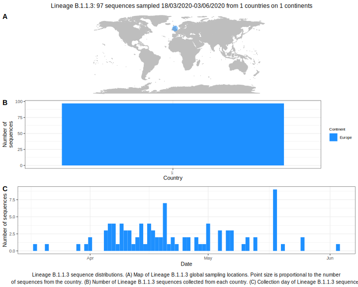

<h2> Lineage summaries</h2>

| Lineage name | Most common countries | Date range | Number of taxa |  Days since last sampling | Known Travel | Recall value |
|:-----|:-----|:-------|-------:|-------:|:---------|--------:|
| B.1.1.3 | UK (100%) | March 18 to May 06 | 53 | 4 |  | 100.0 |

<h2>Lineage descriptions</h2>

| Lineage | Notes |
|:-----|:-----|
| B.1.1.3 | Formerly B.1.65, English lineage (BS=100) |

