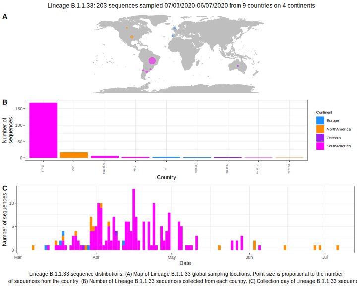

<ul class="actions small">
	 <a href="{{ 'lineages/lineage_B.1.1.html' | absolute_url }}" class="button special fit">Go to parent lineage: B.1.1</a>
</ul>

<h3> Lineage summaries</h3>

| Lineage name | Most common countries | Date range | Number of taxa |  Days since last sampling | Known Travel | Recall value |
|:-----|:-----|:-------|-------:|-------:|:---------|--------:|
| <a href="{{ 'lineages/lineage_B.1.1.33.html' | absolute_url }}">B.1.1.33</a> | Brazil (77%), USA (9%), Chile (5%) | March 01 to April 28 | 172 | 55 |  | 1.000 |

<h3>Lineage descriptions</h3>

| Lineage | Notes |
|:-----|:-----|
| <a href="{{ 'lineages/lineage_B.1.1.33.html' | absolute_url }}">B.1.1.33</a> | Majoritively South American lineage, lots of Brazil sequences represented (BS=71) |

