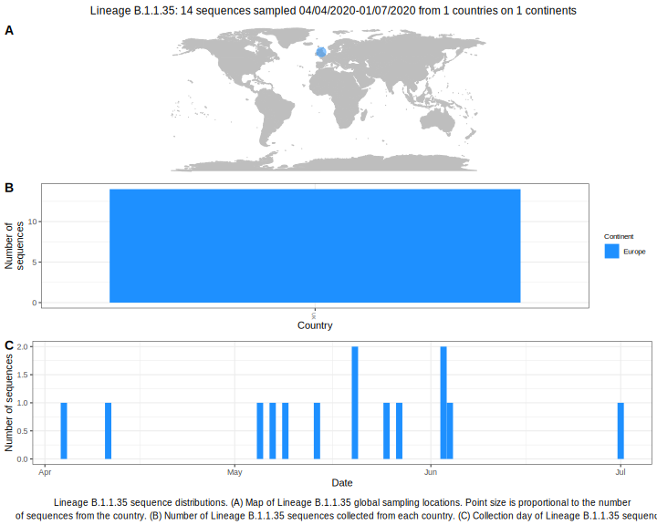

<ul class="actions small">
	 <a href="{{ 'lineages/lineage_B.1.1.html' | absolute_url }}" class="button special fit">Go to parent lineage: B.1.1</a>
</ul>

<h3> Lineage summaries</h3>

| Lineage name | Most common countries | Date range | Number of taxa |  Days since last sampling | Known Travel | Recall value |
|:-----|:-----|:-------|-------:|-------:|:---------|--------:|
| <a href="{{ 'lineages/lineage_B.1.1.35.html' | absolute_url }}">B.1.1.35</a> | UK (100%), Switzerland (0%), Uganda (0%) | March 02 to August 18 | 2649 | UK to Iceland (1) | 0.99 |

<h3>Lineage descriptions</h3>

| Lineage | Notes |
|:-----|:-----|
| <a href="{{ 'lineages/lineage_B.1.1.35.html' | absolute_url }}">B.1.1.35</a> | Previously a large part of B.1.1.1, however in the most recent phylogeny, this has become a sister lineage to B.1.1.1. UK sequences represented in this lineage. |

