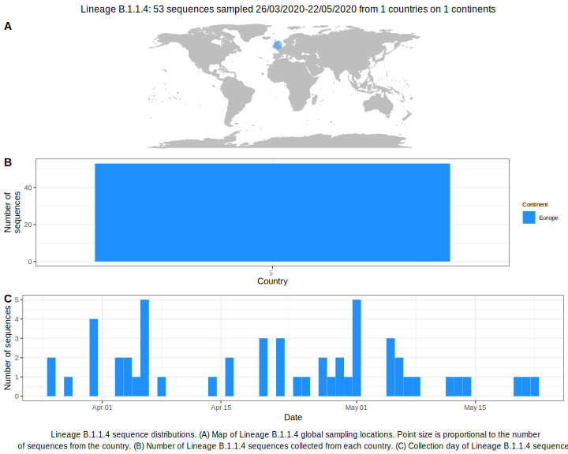

| Lineage | Notes |
|:-----|:-----|
| B.1.1.4 | Formerly B.1.55, UK (BS=100) |

<h2>Lineage B.1.1.4 composition summary </h2>

<strong>Total number of sequences:</strong> 50

| Lineage name | Most common countries | Date range | Number of taxa |  Days since last sampling | Known Travel | Recall value |
|:-----|:-----|:-------|-------:|-------:|:---------|--------:|
| B.1.1.4 | UK (100%) | March 26 to May 08 | 50 | 2 |  | 100.0 |
