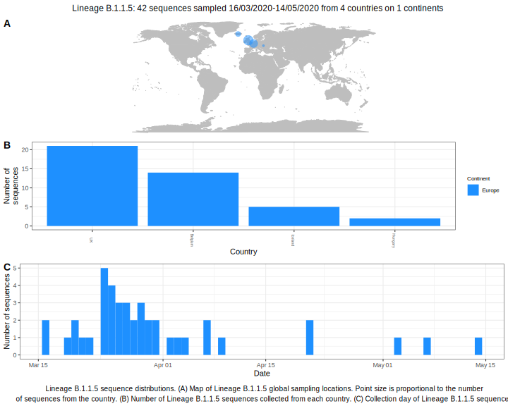

<h2> Lineage summaries</h2>

| Lineage name | Most common countries | Date range | Number of taxa |  Days since last sampling | Known Travel | Recall value |
|:-----|:-----|:-------|-------:|-------:|:---------|--------:|
| B.1.1.5 | UK (59%), Iceland (17%), Belgium (17%) | March 16 to April 09 | 29 | 31 |  | 100.0 |

<h2>Lineage descriptions</h2>

| Lineage | Notes |
|:-----|:-----|
| B.1.1.5 | Formerly B.1.54, Iceland/ Belgium/ UK (BS=100) |

