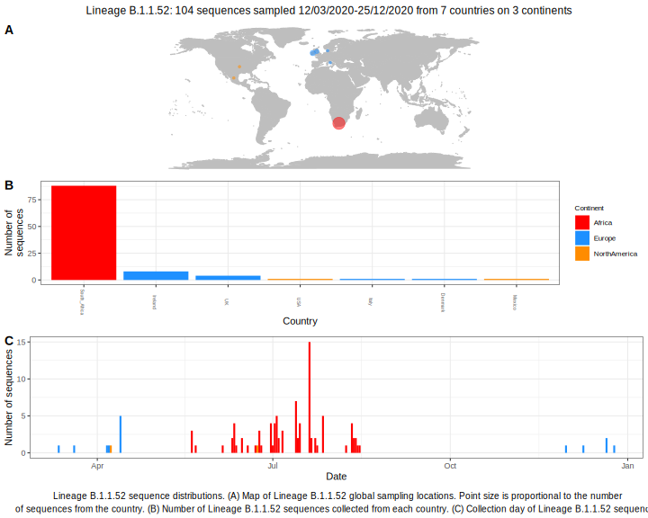

<ul class="actions small">
	 <a href="{{ 'lineages/lineage_B.1.1.html' | absolute_url }}" class="button special fit">Go to parent lineage: B.1.1</a>
</ul>

<h3> Lineage summaries</h3>

| Lineage name | Most common countries | Date range | Number of taxa | Known Travel | Recall value |
|:-----|:-----|:-------|-------:|-------:|:---------|--------:|
| <a href="{{ 'lineages/lineage_B.1.1.52.html' | absolute_url }}">B.1.1.52</a> | UK (69%), South_Africa (31%) | April 05 to October 06 | 65 |  | 0.0 |

<h3>Lineage descriptions</h3>

| Lineage | Notes |
|:-----|:-----|
| <a href="{{ 'lineages/lineage_B.1.1.52.html' | absolute_url }}">B.1.1.52</a> | South African lineage (same parent node as B.1.1.53, but parent node is a large polytomy) |

