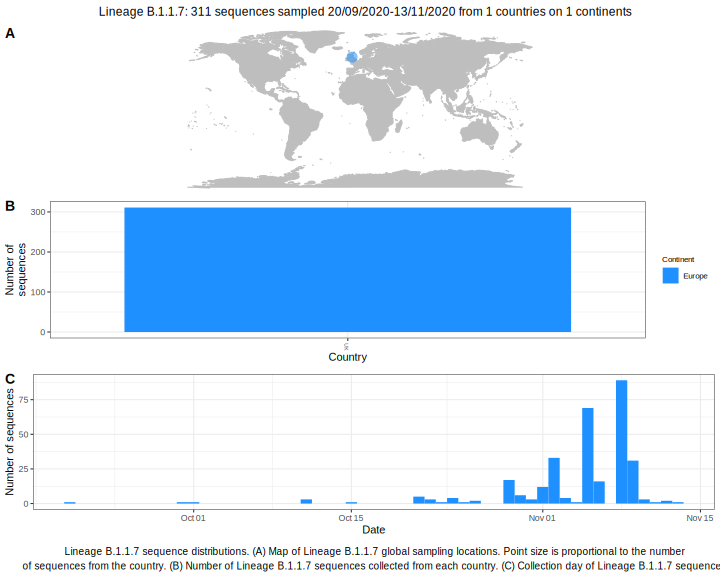

| Lineage | Notes |
|:-----|:-----|
| B.1.1.7 | Formerly B.1.1.56, UK/ Australia/ Iceland (BS=100) |

<h2>Lineage B.1.1.7 composition summary </h2>

<strong>Total number of sequences:</strong> 108

| Lineage name | Most common countries | Date range | Number of taxa |  Days since last sampling | Known Travel | Recall value |
|:-----|:-----|:-------|-------:|-------:|:---------|--------:|
| B.1.1.7 | UK (94%), Iceland (3%), Australia (2%) | March 07 to April 28 | 108 | 12 | USA to Iceland (1)  | 100.0 |
