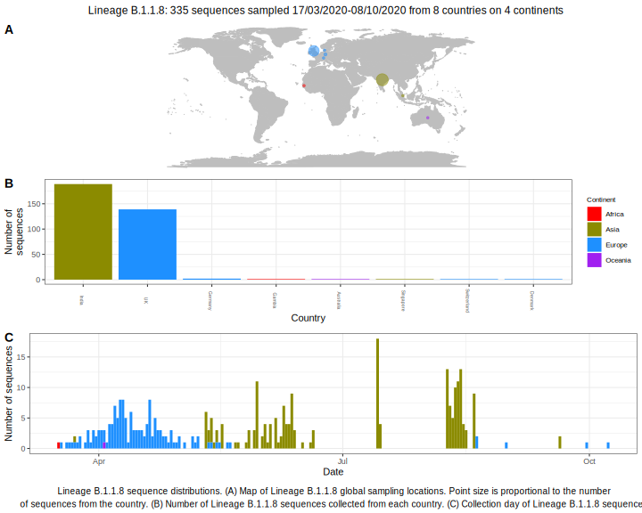

<ul class="actions small">
	 <a href="{{ 'lineages/lineage_B.1.1.html' | absolute_url }}" class="button special fit">Go to parent lineage: B.1.1</a>
</ul>

<h3> Lineage summaries</h3>

| Lineage name | Most common countries | Date range | Number of taxa |  Days since last sampling | Known Travel | Recall value |
|:-----|:-----|:-------|-------:|-------:|:---------|--------:|
| <a href="{{ 'lineages/lineage_B.1.1.8.html' | absolute_url }}">B.1.1.8</a> | UK (89%), Australia (8%), Gambia (2%) | March 17 to April 28 | 65 | 12 |  | 100.0 |

<h3>Lineage descriptions</h3>

| Lineage | Notes |
|:-----|:-----|
| <a href="{{ 'lineages/lineage_B.1.1.8.html' | absolute_url }}">B.1.1.8</a> | Formerly B.1.63, UK/ USA/ Australia (BS=100) |

