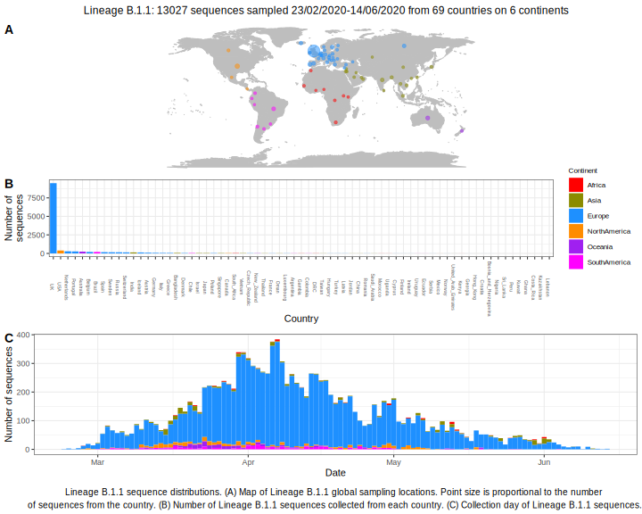

<ul class="actions small">
	 <a href="{{ 'lineages/lineage_B.1.html' | absolute_url }}" class="button special fit">Go to parent lineage: B.1</a>
</ul>

<h3> Lineage summaries</h3>

| Lineage name | Most common countries | Date range | Number of taxa | Known Travel | Recall value |
|:-----|:-----|:-------|-------:|-------:|:---------|--------:|
| <a href="{{ 'lineages/lineage_B.1.1.html' | absolute_url }}">B.1.1</a> | UK (83%), USA (5%), Portugal (1%) | February 10 to October 18 | 28655 | Italy to Czech_Republic, Chile, Thailand, Iceland, Nigeria, Mexico (11), UK to Slovakia, China, Iceland (7), Switzerland to Iceland (1), Austria to Iceland (1), Finland to Iceland (1), Saudia_Arabia to Turkey (1), Hungary to China (3), Nicaragua to Costa_Rica (2), Maldives to Slovakia (1) | 0.97 |
| <a href="{{ 'lineages/lineage_B.1.1.1.html' | absolute_url }}">B.1.1.1</a> | UK (88%), Peru (2%), South_Africa (1%) | March 03 to October 16 | 2318 | Austria to Iceland (2) | 0.56 |
| <a href="{{ 'lineages/lineage_B.1.1.10.html' | absolute_url }}">B.1.1.10</a> | UK (80%), Canada (7%), USA (4%) | March 05 to October 15 | 621 | UK to Iceland (1), USA to Iceland (1) | 0.77 |
| <a href="{{ 'lineages/lineage_B.1.1.12.html' | absolute_url }}">B.1.1.12</a> | UK (94%), Ecuador (3%), Switzerland (3%) | March 21 to October 04 | 35 |  | 0.72 |
| <a href="{{ 'lineages/lineage_B.1.1.13.html' | absolute_url }}">B.1.1.13</a> | UK (100%) | March 28 to April 29 | 16 |  | 1.0 |
| <a href="{{ 'lineages/lineage_B.1.1.14.html' | absolute_url }}">B.1.1.14</a> | UK (100%) | April 16 to October 05 | 59 |  | 1.0 |
| <a href="{{ 'lineages/lineage_B.1.1.15.html' | absolute_url }}">B.1.1.15</a> | UK (93%), Portugal (3%), Luxembourg (1%) | March 09 to October 19 | 407 |  | 0.82 |
| <a href="{{ 'lineages/lineage_B.1.1.16.html' | absolute_url }}">B.1.1.16</a> | UK (98%), India (2%) | April 03 to August 27 | 52 |  | 0.97 |
| <a href="{{ 'lineages/lineage_B.1.1.17.html' | absolute_url }}">B.1.1.17</a> | Iceland (89%), UK (11%) | March 06 to August 08 | 9 | Italy to Iceland (1) | 0.88 |
| <a href="{{ 'lineages/lineage_B.1.1.2.html' | absolute_url }}">B.1.1.2</a> | UK (100%) | March 20 to September 24 | 570 |  | 0.99 |
| <a href="{{ 'lineages/lineage_B.1.1.20.html' | absolute_url }}">B.1.1.20</a> | UK (59%), Portugal (16%), USA (12%) | March 21 to September 03 | 32 |  | 0.93 |
| <a href="{{ 'lineages/lineage_B.1.1.25.html' | absolute_url }}">B.1.1.25</a> | Bangladesh (52%), UK (36%), Australia (8%) | February 29 to October 07 | 368 |  | 0.31 |
| <a href="{{ 'lineages/lineage_B.1.1.26.html' | absolute_url }}">B.1.1.26</a> | USA (60%), UK (39%), Peru (1%) | March 16 to September 18 | 77 |  | 0.89 |
| <a href="{{ 'lineages/lineage_B.1.1.27.html' | absolute_url }}">B.1.1.27</a> | Oman (94%), United_Arab_Emirates (5%), UK (1%) | March 21 to September 17 | 82 |  | 1.0 |
| <a href="{{ 'lineages/lineage_B.1.1.28.html' | absolute_url }}">B.1.1.28</a> | Brazil (81%), UK (12%), Australia (2%) | March 15 to October 13 | 206 |  | 0.99 |
| <a href="{{ 'lineages/lineage_B.1.1.29.html' | absolute_url }}">B.1.1.29</a> | UK (100%) | February 28 to August 27 | 166 |  | 0.98 |
| <a href="{{ 'lineages/lineage_B.1.1.3.html' | absolute_url }}">B.1.1.3</a> | UK (100%) | March 18 to July 22 | 116 |  | 0.99 |
| <a href="{{ 'lineages/lineage_B.1.1.30.html' | absolute_url }}">B.1.1.30</a> | UK (98%), Lithuania (1%), USA (1%) | March 12 to September 26 | 737 |  | 0.98 |
| <a href="{{ 'lineages/lineage_B.1.1.31.html' | absolute_url }}">B.1.1.31</a> | UK (71%), Netherlands (28%), Spain (1%) | March 25 to October 06 | 79 |  | 0.15 |
| <a href="{{ 'lineages/lineage_B.1.1.32.html' | absolute_url }}">B.1.1.32</a> | India (94%), UK (4%), USA (1%) | March 24 to October 11 | 500 |  | 0.99 |
| <a href="{{ 'lineages/lineage_B.1.1.33.html' | absolute_url }}">B.1.1.33</a> | Brazil (76%), USA (8%), UK (4%) | March 12 to October 13 | 289 | Germany to Brazil (1) | 0.98 |
| <a href="{{ 'lineages/lineage_B.1.1.34.html' | absolute_url }}">B.1.1.34</a> | South_Africa (63%), UK (30%), USA (3%) | March 19 to September 06 | 30 |  | 1.0 |
| <a href="{{ 'lineages/lineage_B.1.1.35.html' | absolute_url }}">B.1.1.35</a> | UK (96%), Peru (1%), New_Zealand (1%) | March 02 to October 15 | 3851 | UK to Iceland (1) | 0.98 |
| <a href="{{ 'lineages/lineage_B.1.1.36.html' | absolute_url }}">B.1.1.36</a> | USA (100%) | April 06 to July 14 | 23 |  | 1.0 |
| <a href="{{ 'lineages/lineage_B.1.1.37.html' | absolute_url }}">B.1.1.37</a> | UK (100%), Switzerland (0%), Netherlands (0%) | March 19 to October 16 | 2630 |  | 0.98 |
| <a href="{{ 'lineages/lineage_B.1.1.38.html' | absolute_url }}">B.1.1.38</a> | UK (98%), USA (2%) | April 29 to September 08 | 111 |  | 0.99 |
| <a href="{{ 'lineages/lineage_B.1.1.39.html' | absolute_url }}">B.1.1.39</a> | Switzerland (53%), UK (35%), Norway (8%) | July 01 to October 06 | 119 |  | 1.0 |
| <a href="{{ 'lineages/lineage_B.1.1.4.html' | absolute_url }}">B.1.1.4</a> | UK (100%) | March 31 to October 03 | 343 |  | 0.99 |
| <a href="{{ 'lineages/lineage_B.1.1.40.html' | absolute_url }}">B.1.1.40</a> | South_Africa (91%), Russia (9%) | May 13 to August 06 | 11 |  | 0.89 |
| <a href="{{ 'lineages/lineage_B.1.1.41.html' | absolute_url }}">B.1.1.41</a> | UK (100%) | March 21 to August 12 | 183 |  | 1.0 |
| <a href="{{ 'lineages/lineage_B.1.1.42.html' | absolute_url }}">B.1.1.42</a> | UK (60%), Turkey (29%), Switzerland (3%) | April 13 to October 08 | 62 |  | 0.0 |
| <a href="{{ 'lineages/lineage_B.1.1.43.html' | absolute_url }}">B.1.1.43</a> | UK (98%), Spain (1%), USA (1%) | March 20 to October 09 | 142 |  | 0.46 |
| <a href="{{ 'lineages/lineage_B.1.1.44.html' | absolute_url }}">B.1.1.44</a> | UK (98%), USA (1%), Lithuania (0%) | March 23 to October 10 | 311 |  | 0.6 |
| <a href="{{ 'lineages/lineage_B.1.1.45.html' | absolute_url }}">B.1.1.45</a> | UK (100%) | May 22 to July 15 | 64 |  | 1.0 |
| <a href="{{ 'lineages/lineage_B.1.1.46.html' | absolute_url }}">B.1.1.46</a> | India (76%), UK (15%), Brazil (4%) | April 20 to October 05 | 46 |  | 1.0 |
| <a href="{{ 'lineages/lineage_B.1.1.47.html' | absolute_url }}">B.1.1.47</a> | UK (49%), Switzerland (44%), Italy (2%) | April 03 to September 19 | 55 |  | 0.83 |
| <a href="{{ 'lineages/lineage_B.1.1.48.html' | absolute_url }}">B.1.1.48</a> | Japan (100%) | March 29 to April 11 | 7 |  | 0.86 |
| <a href="{{ 'lineages/lineage_B.1.1.49.html' | absolute_url }}">B.1.1.49</a> | UK (94%), USA (6%) | March 23 to September 05 | 70 |  | 0.04 |
| <a href="{{ 'lineages/lineage_B.1.1.5.html' | absolute_url }}">B.1.1.5</a> | UK (54%), Belgium (27%), Iceland (6%) | March 16 to August 21 | 52 |  | 0.05 |
| <a href="{{ 'lineages/lineage_B.1.1.50.html' | absolute_url }}">B.1.1.50</a> | UK (51%), Israel (25%), Netherlands (23%) | March 29 to October 14 | 57 |  | 0.65 |
| <a href="{{ 'lineages/lineage_B.1.1.51.html' | absolute_url }}">B.1.1.51</a> | UK (100%) | March 25 to October 15 | 568 |  | 0.99 |
| <a href="{{ 'lineages/lineage_B.1.1.52.html' | absolute_url }}">B.1.1.52</a> | UK (69%), South_Africa (31%) | April 05 to October 06 | 65 |  | 0.0 |
| <a href="{{ 'lineages/lineage_B.1.1.53.html' | absolute_url }}">B.1.1.53</a> | South_Africa (65%), USA (27%), Switzerland (4%) | April 02 to September 28 | 26 |  | 0.45 |
| <a href="{{ 'lineages/lineage_B.1.1.54.html' | absolute_url }}">B.1.1.54</a> | South_Africa (91%), UK (8%), USA (1%) | March 19 to October 08 | 253 | Maldives to Taiwan (1) | 0.71 |
| <a href="{{ 'lineages/lineage_B.1.1.55.html' | absolute_url }}">B.1.1.55</a> | UK (88%), USA (6%), France (3%) | March 20 to October 15 | 186 |  | 0.75 |
| <a href="{{ 'lineages/lineage_B.1.1.56.html' | absolute_url }}">B.1.1.56</a> | South_Africa (82%), UK (17%), Australia (1%) | March 21 to October 15 | 103 |  | 0.57 |
| <a href="{{ 'lineages/lineage_B.1.1.57.html' | absolute_url }}">B.1.1.57</a> | South_Africa (91%), Russia (9%) | March 31 to July 30 | 22 |  | 1.0 |
| <a href="{{ 'lineages/lineage_B.1.1.58.html' | absolute_url }}">B.1.1.58</a> | Switzerland (67%), UK (33%) | June 23 to October 05 | 15 |  | 0.86 |
| <a href="{{ 'lineages/lineage_B.1.1.59.html' | absolute_url }}">B.1.1.59</a> | UK (99%), Bangladesh (1%), USA (1%) | March 08 to July 22 | 162 |  | 0.98 |
| <a href="{{ 'lineages/lineage_B.1.1.6.html' | absolute_url }}">B.1.1.6</a> | Austria (80%), Switzerland (10%), USA (10%) | February 26 to June 04 | 10 |  | 0.0 |
| <a href="{{ 'lineages/lineage_B.1.1.60.html' | absolute_url }}">B.1.1.60</a> | UK (98%), USA (1%), Russia (1%) | March 19 to September 10 | 369 |  | 0.98 |
| <a href="{{ 'lineages/lineage_B.1.1.61.html' | absolute_url }}">B.1.1.61</a> | USA (92%), Canada (5%), Italy (3%) | February 29 to August 11 | 39 |  | 0.53 |
| <a href="{{ 'lineages/lineage_B.1.1.62.html' | absolute_url }}">B.1.1.62</a> | South_Africa (75%), UK (21%), Australia (4%) | March 23 to July 30 | 24 |  | 0.7 |
| <a href="{{ 'lineages/lineage_B.1.1.63.html' | absolute_url }}">B.1.1.63</a> | Hong_Kong (68%), South_Korea (12%), UK (8%) | June 30 to September 07 | 25 |  | 0.7 |
| <a href="{{ 'lineages/lineage_B.1.1.64.html' | absolute_url }}">B.1.1.64</a> | UK (94%), USA (2%), Australia (1%) | March 11 to October 15 | 299 |  | 0.99 |
| <a href="{{ 'lineages/lineage_B.1.1.65.html' | absolute_url }}">B.1.1.65</a> | USA (97%), UK (3%) | April 15 to August 11 | 38 |  | 0.84 |
| <a href="{{ 'lineages/lineage_B.1.1.66.html' | absolute_url }}">B.1.1.66</a> | South_Africa (62%), UK (33%), USA (3%) | April 05 to September 27 | 39 |  | 0.95 |
| <a href="{{ 'lineages/lineage_B.1.1.67.html' | absolute_url }}">B.1.1.67</a> | UK (79%), South_Africa (19%), USA (1%) | May 12 to September 24 | 132 |  | 0.32 |
| <a href="{{ 'lineages/lineage_B.1.1.68.html' | absolute_url }}">B.1.1.68</a> | Russia (83%), UK (12%), USA (4%) | April 03 to October 09 | 24 |  | 0.0 |
| <a href="{{ 'lineages/lineage_B.1.1.7.html' | absolute_url }}">B.1.1.7</a> | UK (89%), Japan (3%), Australia (2%) | March 07 to October 11 | 243 | USA to Iceland (1) | 0.98 |
| <a href="{{ 'lineages/lineage_B.1.1.70.html' | absolute_url }}">B.1.1.70</a> | UK (68%), Switzerland (17%), Serbia (7%) | March 24 to October 16 | 301 |  | 0.72 |
| <a href="{{ 'lineages/lineage_B.1.1.71.html' | absolute_url }}">B.1.1.71</a> | Netherlands (37%), UK (29%), Australia (7%) | March 06 to June 16 | 68 |  | 1.0 |
| <a href="{{ 'lineages/lineage_B.1.1.72.html' | absolute_url }}">B.1.1.72</a> | UK (41%), India (37%), Singapore (14%) | March 28 to October 09 | 106 |  | 0.71 |
| <a href="{{ 'lineages/lineage_B.1.1.73.html' | absolute_url }}">B.1.1.73</a> | USA (95%), UK (5%) | April 17 to September 15 | 106 |  | 1.0 |
| <a href="{{ 'lineages/lineage_B.1.1.74.html' | absolute_url }}">B.1.1.74</a> | UK (89%), Belgium (11%), Netherlands (0%) | March 29 to September 09 | 241 |  | 1.0 |
| <a href="{{ 'lineages/lineage_B.1.1.75.html' | absolute_url }}">B.1.1.75</a> | UK (39%), Belgium (25%), Sweden (11%) | March 20 to August 27 | 44 |  | 0.92 |
| <a href="{{ 'lineages/lineage_B.1.1.76.html' | absolute_url }}">B.1.1.76</a> | USA (87%), UK (10%), Spain (3%) | April 03 to July 21 | 39 |  | 0.81 |
| <a href="{{ 'lineages/lineage_B.1.1.77.html' | absolute_url }}">B.1.1.77</a> | USA (96%), UK (3%), Peru (0%) | March 18 to September 29 | 442 |  | 0.67 |
| <a href="{{ 'lineages/lineage_B.1.1.8.html' | absolute_url }}">B.1.1.8</a> | India (98%), UK (2%) | May 11 to October 01 | 184 |  | 0.99 |

<h3>Lineage descriptions</h3>

| Lineage | Notes |
|:-----|:-----|
| <a href="{{ 'lineages/lineage_B.1.1.html' | absolute_url }}">B.1.1</a> | European lineage that's been assigned due to high support and 3 clear SNPs `28881GA`,`28882GA`,`28883GC` |
| <a href="{{ 'lineages/lineage_B.1.1.1.html' | absolute_url }}">B.1.1.1</a> | UK/ Europe  |
| <a href="{{ 'lineages/lineage_B.1.1.10.html' | absolute_url }}">B.1.1.10</a> | Formerly UK/ Iceland, a lot of diversity in this lineage, now has a Turkish sequence.  |
| <a href="{{ 'lineages/lineage_B.1.1.12.html' | absolute_url }}">B.1.1.12</a> | Scottish lineage  |
| <a href="{{ 'lineages/lineage_B.1.1.13.html' | absolute_url }}">B.1.1.13</a> | UK lineage (CAMB) |
| <a href="{{ 'lineages/lineage_B.1.1.14.html' | absolute_url }}">B.1.1.14</a> | Scottish lineage  |
| <a href="{{ 'lineages/lineage_B.1.1.15.html' | absolute_url }}">B.1.1.15</a> | Luxembourgh/ UK/ Portugal lineage |
| <a href="{{ 'lineages/lineage_B.1.1.16.html' | absolute_url }}">B.1.1.16</a> | Wales lineage (some reassigned to B.1.1 as split up in most recent phylogeny) |
| <a href="{{ 'lineages/lineage_B.1.1.17.html' | absolute_url }}">B.1.1.17</a> | Iceland lineage  |
| <a href="{{ 'lineages/lineage_B.1.1.19.html' | absolute_url }}">B.1.1.19</a> | Reassigned to B.1.1 as split up in most recent phylogeny. Australian lineage  |
| <a href="{{ 'lineages/lineage_B.1.1.2.html' | absolute_url }}">B.1.1.2</a> | Welsh lineage  |
| <a href="{{ 'lineages/lineage_B.1.1.20.html' | absolute_url }}">B.1.1.20</a> | Scottish lineage  |
| <a href="{{ 'lineages/lineage_B.1.1.21.html' | absolute_url }}">B.1.1.21</a> | Australian lineage reassigned to B.1.1 in most recent phylogeny |
| <a href="{{ 'lineages/lineage_B.1.1.22.html' | absolute_url }}">B.1.1.22</a> | South African lineage |
| <a href="{{ 'lineages/lineage_B.1.1.23.html' | absolute_url }}">B.1.1.23</a> | Bangladesh lineage, merged into B.1.1.25 in most recent phylogeny |
| <a href="{{ 'lineages/lineage_B.1.1.24.html' | absolute_url }}">B.1.1.24</a> | Portuguese lineage |
| <a href="{{ 'lineages/lineage_B.1.1.25.html' | absolute_url }}">B.1.1.25</a> | Bangladesh lineage |
| <a href="{{ 'lineages/lineage_B.1.1.26.html' | absolute_url }}">B.1.1.26</a> | US lineage (WA) |
| <a href="{{ 'lineages/lineage_B.1.1.27.html' | absolute_url }}">B.1.1.27</a> | Lineage in Oman |
| <a href="{{ 'lineages/lineage_B.1.1.28.html' | absolute_url }}">B.1.1.28</a> | Brazil lineage, some sister sequences from parent node are also from Brazil, however there's sequences from a variety of other locations on that node. |
| <a href="{{ 'lineages/lineage_B.1.1.29.html' | absolute_url }}">B.1.1.29</a> | Wales lineage  |
| <a href="{{ 'lineages/lineage_B.1.1.3.html' | absolute_url }}">B.1.1.3</a> | English lineage  |
| <a href="{{ 'lineages/lineage_B.1.1.30.html' | absolute_url }}">B.1.1.30</a> | UK lineage (Wales & England) |
| <a href="{{ 'lineages/lineage_B.1.1.31.html' | absolute_url }}">B.1.1.31</a> | Netherlands lineage  |
| <a href="{{ 'lineages/lineage_B.1.1.32.html' | absolute_url }}">B.1.1.32</a> | Indian lineage  |
| <a href="{{ 'lineages/lineage_B.1.1.33.html' | absolute_url }}">B.1.1.33</a> | Majoritively South American lineage, lots of Brazil sequences represented  |
| <a href="{{ 'lineages/lineage_B.1.1.34.html' | absolute_url }}">B.1.1.34</a> | South African lineage |
| <a href="{{ 'lineages/lineage_B.1.1.35.html' | absolute_url }}">B.1.1.35</a> | Previously a large part of B.1.1.1, however in the most recent phylogeny, this has become a sister lineage to B.1.1.1. UK sequences represented in this lineage. |
| <a href="{{ 'lineages/lineage_B.1.1.36.html' | absolute_url }}">B.1.1.36</a> | USA (CA) lineage |
| <a href="{{ 'lineages/lineage_B.1.1.37.html' | absolute_url }}">B.1.1.37</a> | UK lineage (England) |
| <a href="{{ 'lineages/lineage_B.1.1.38.html' | absolute_url }}">B.1.1.38</a> | Wales lineage |
| <a href="{{ 'lineages/lineage_B.1.1.39.html' | absolute_url }}">B.1.1.39</a> | Swiss lineage |
| <a href="{{ 'lineages/lineage_B.1.1.4.html' | absolute_url }}">B.1.1.4</a> | UK lineage |
| <a href="{{ 'lineages/lineage_B.1.1.40.html' | absolute_url }}">B.1.1.40</a> | South African lineage |
| <a href="{{ 'lineages/lineage_B.1.1.41.html' | absolute_url }}">B.1.1.41</a> | English lineage |
| <a href="{{ 'lineages/lineage_B.1.1.42.html' | absolute_url }}">B.1.1.42</a> | Turkish lineage |
| <a href="{{ 'lineages/lineage_B.1.1.43.html' | absolute_url }}">B.1.1.43</a> | Scottish lineage |
| <a href="{{ 'lineages/lineage_B.1.1.44.html' | absolute_url }}">B.1.1.44</a> | UK lineage |
| <a href="{{ 'lineages/lineage_B.1.1.45.html' | absolute_url }}">B.1.1.45</a> | UK lineage |
| <a href="{{ 'lineages/lineage_B.1.1.46.html' | absolute_url }}">B.1.1.46</a> | Indian lineage |
| <a href="{{ 'lineages/lineage_B.1.1.47.html' | absolute_url }}">B.1.1.47</a> | Swiss lineage |
| <a href="{{ 'lineages/lineage_B.1.1.48.html' | absolute_url }}">B.1.1.48</a> | Japanese lineage |
| <a href="{{ 'lineages/lineage_B.1.1.49.html' | absolute_url }}">B.1.1.49</a> | Wales lineage |
| <a href="{{ 'lineages/lineage_B.1.1.5.html' | absolute_url }}">B.1.1.5</a> | Iceland/ Belgium/ UK  |
| <a href="{{ 'lineages/lineage_B.1.1.50.html' | absolute_url }}">B.1.1.50</a> | UK/ Israel lineage |
| <a href="{{ 'lineages/lineage_B.1.1.51.html' | absolute_url }}">B.1.1.51</a> | UK lineage |
| <a href="{{ 'lineages/lineage_B.1.1.52.html' | absolute_url }}">B.1.1.52</a> | South African lineage (same parent node as B.1.1.53, but parent node is a large polytomy) |
| <a href="{{ 'lineages/lineage_B.1.1.53.html' | absolute_url }}">B.1.1.53</a> | South African lineage (same parent node as B.1.1.53, but parent node is a large polytomy) |
| <a href="{{ 'lineages/lineage_B.1.1.54.html' | absolute_url }}">B.1.1.54</a> | South African lineage |
| <a href="{{ 'lineages/lineage_B.1.1.55.html' | absolute_url }}">B.1.1.55</a> | England lineage |
| <a href="{{ 'lineages/lineage_B.1.1.56.html' | absolute_url }}">B.1.1.56</a> | South African lineage |
| <a href="{{ 'lineages/lineage_B.1.1.57.html' | absolute_url }}">B.1.1.57</a> | South African lineage |
| <a href="{{ 'lineages/lineage_B.1.1.58.html' | absolute_url }}">B.1.1.58</a> | Swiss lineage |
| <a href="{{ 'lineages/lineage_B.1.1.59.html' | absolute_url }}">B.1.1.59</a> | Wales lineage |
| <a href="{{ 'lineages/lineage_B.1.1.6.html' | absolute_url }}">B.1.1.6</a> | Austrian lineage |
| <a href="{{ 'lineages/lineage_B.1.1.60.html' | absolute_url }}">B.1.1.60</a> | Northern Ireland lineage |
| <a href="{{ 'lineages/lineage_B.1.1.61.html' | absolute_url }}">B.1.1.61</a> | USA lineage (CA) |
| <a href="{{ 'lineages/lineage_B.1.1.62.html' | absolute_url }}">B.1.1.62</a> | South African lienage |
| <a href="{{ 'lineages/lineage_B.1.1.63.html' | absolute_url }}">B.1.1.63</a> | Hong Kong lineage |
| <a href="{{ 'lineages/lineage_B.1.1.64.html' | absolute_url }}">B.1.1.64</a> | UK lineage |
| <a href="{{ 'lineages/lineage_B.1.1.65.html' | absolute_url }}">B.1.1.65</a> | USA lineage (WA), previously B.1.1.26, however split in most recent phylogeny |
| <a href="{{ 'lineages/lineage_B.1.1.66.html' | absolute_url }}">B.1.1.66</a> | South African lineage |
| <a href="{{ 'lineages/lineage_B.1.1.67.html' | absolute_url }}">B.1.1.67</a> | English/ South African lineage |
| <a href="{{ 'lineages/lineage_B.1.1.68.html' | absolute_url }}">B.1.1.68</a> | Russian lineage |
| <a href="{{ 'lineages/lineage_B.1.1.69.html' | absolute_url }}">B.1.1.69</a> | Switzerland/ UK/ Italy lineage |
| <a href="{{ 'lineages/lineage_B.1.1.7.html' | absolute_url }}">B.1.1.7</a> | UK lineage |
| <a href="{{ 'lineages/lineage_B.1.1.70.html' | absolute_url }}">B.1.1.70</a> | Northern Ireland lineage |
| <a href="{{ 'lineages/lineage_B.1.1.71.html' | absolute_url }}">B.1.1.71</a> | Australian/ Belgium/ Netherlands lineage |
| <a href="{{ 'lineages/lineage_B.1.1.72.html' | absolute_url }}">B.1.1.72</a> | UK/ India lineage |
| <a href="{{ 'lineages/lineage_B.1.1.73.html' | absolute_url }}">B.1.1.73</a> | USA lineage |
| <a href="{{ 'lineages/lineage_B.1.1.74.html' | absolute_url }}">B.1.1.74</a> | Northern Ireland/ Belgium lineage |
| <a href="{{ 'lineages/lineage_B.1.1.75.html' | absolute_url }}">B.1.1.75</a> | Belgium/ South Africa/ DRC lineage |
| <a href="{{ 'lineages/lineage_B.1.1.76.html' | absolute_url }}">B.1.1.76</a> | USA lineage (WA) |
| <a href="{{ 'lineages/lineage_B.1.1.77.html' | absolute_url }}">B.1.1.77</a> | USA lineage (WA) |
| <a href="{{ 'lineages/lineage_B.1.1.8.html' | absolute_url }}">B.1.1.8</a> | Indian lineage |
| <a href="{{ 'lineages/lineage_B.1.1.9.html' | absolute_url }}">B.1.1.9</a> | Reassigned B.1.1, split into three this week, unstable lineage |
| <a href="{{ 'lineages/lineage_B.1.1.p11.html' | absolute_url }}">B.1.1.p11</a> | Reassigned B.1.1, previously Portugal/ Wales/ England/ Ecuador  |

