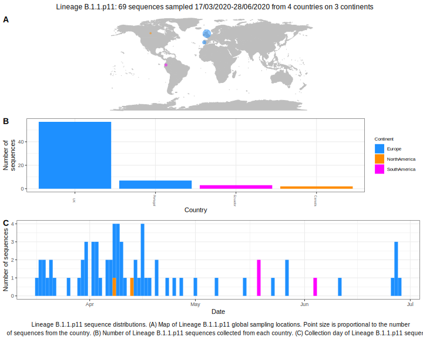

| Lineage | Notes |
|:-----|:-----|
| B.1.1.p11 | Formerly B.1.50, Portugal/ Wales (BS=55 this week) |

<h2>Lineage B.1.1.p11 composition summary </h2>

<strong>Total number of sequences:</strong> 28

| Lineage name | Most common countries | Date range | Number of taxa |  Days since last sampling | Known Travel | Recall value |
|:-----|:-----|:-------|-------:|-------:|:---------|--------:|
| B.1.1.p11 | UK (89%), Portugal (11%) | March 17 to April 16 | 28 | 24 |  | 80.0 |
