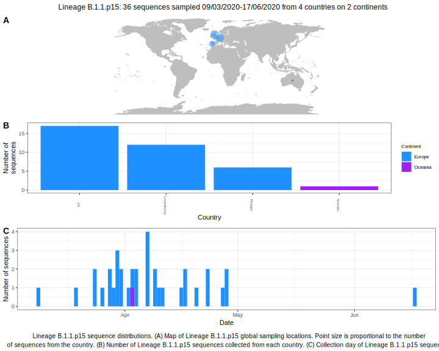

<h2> Lineage summaries</h2>

| Lineage name | Most common countries | Date range | Number of taxa |  Days since last sampling | Known Travel | Recall value |
|:-----|:-----|:-------|-------:|-------:|:---------|--------:|
| B.1.1.p15 | Luxembourg (75%), UK (17%), Australia (8%) | March 19 to April 17 | 12 | 23 |  | 52.17 |

<h2>Lineage descriptions</h2>

| Lineage | Notes |
|:-----|:-----|
| B.1.1.p15 | Formerly B.1.46, Luxembourg (BS=11, but internal nodes all 100 and all Luxembourg) |

