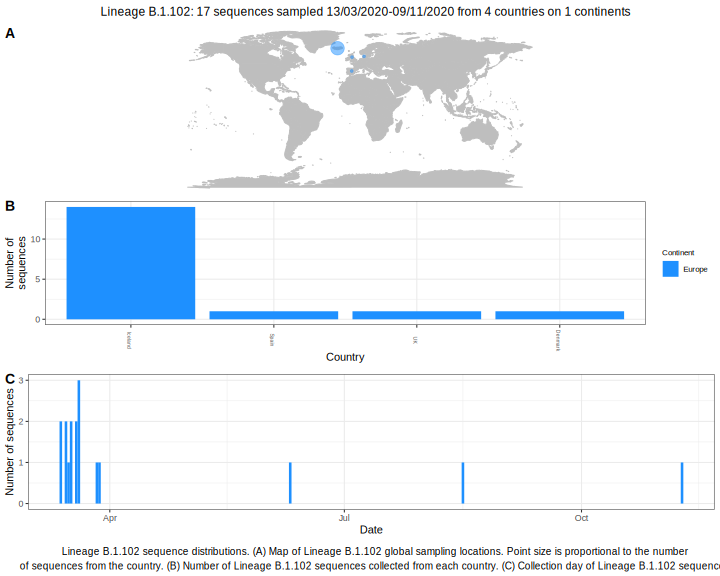

<ul class="actions small">
	 <a href="{{ 'lineages/lineage_B.1.html' | absolute_url }}" class="button special fit">Go to parent lineage: B.1</a>
</ul>

<h3> Lineage summaries</h3>

| Lineage name | Most common countries | Date range | Number of taxa |  Days since last sampling | Known Travel | Recall value |
|:-----|:-----|:-------|-------:|-------:|:---------|--------:|
| <a href="{{ 'lineages/lineage_B.1.102.html' | absolute_url }}">B.1.102</a> | Iceland (98%), Spain (2%) | March 12 to March 28 | 95 | 86 | Argentina to Iceland (1) | 1.000 |

<h3>Lineage descriptions</h3>

| Lineage | Notes |
|:-----|:-----|
| <a href="{{ 'lineages/lineage_B.1.102.html' | absolute_url }}">B.1.102</a> | Icelandic lineage, previously assigned B.1.5.1 |

