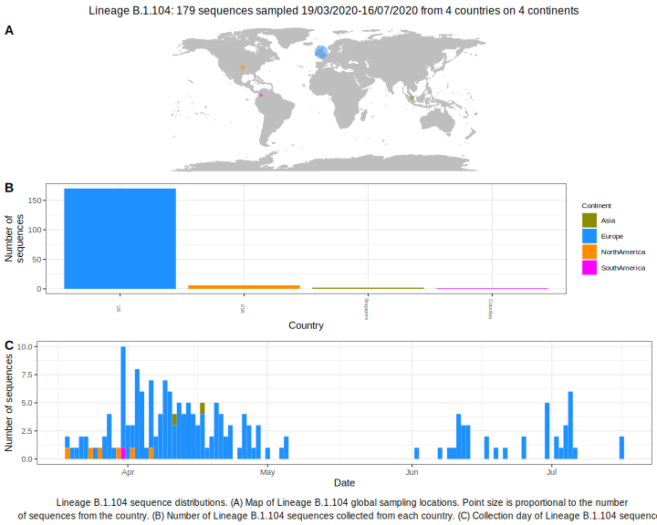

<ul class="actions small">
	 <a href="{{ 'lineages/lineage_B.1.1.1.html' | absolute_url }}" class="button special fit">Go to parent lineage: B.1</a>
</ul>

<h3> Lineage summaries</h3>

| Lineage name | Most common countries | Date range | Number of taxa |  Days since last sampling | Known Travel | Recall value |
|:-----|:-----|:-------|-------:|-------:|:---------|--------:|
| <a href="{{ 'lineages/lineage_B.1.104.html' | absolute_url }}">B.1.104</a> | UK (96%), USA (2%), Singapore (1%) | March 19 to July 16 | 178 | 37 |  | 0.5 |

<h3>Lineage descriptions</h3>

| Lineage | Notes |
|:-----|:-----|
| <a href="{{ 'lineages/lineage_B.1.104.html' | absolute_url }}">B.1.104</a> | English lineage |

