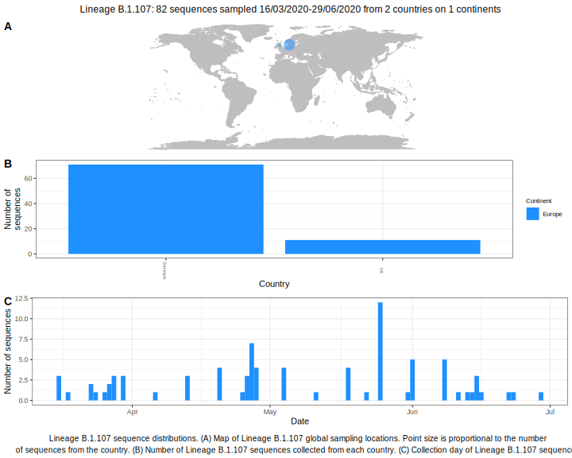

<ul class="actions small">
	 <a href="{{ 'lineages/lineage_B.1.html' | absolute_url }}" class="button special fit">Go to parent lineage: B.1</a>
</ul>

<h3> Lineage summaries</h3>

| Lineage name | Most common countries | Date range | Number of taxa |  Days since last sampling | Known Travel | Recall value |
|:-----|:-----|:-------|-------:|-------:|:---------|--------:|
| <a href="{{ 'lineages/lineage_B.1.107.html' | absolute_url }}">B.1.107</a> | Denmark (43%), UK (34%), USA (19%) | March 18 to June 29 | 53 |  | 0.84 |

<h3>Lineage descriptions</h3>

| Lineage | Notes |
|:-----|:-----|
| <a href="{{ 'lineages/lineage_B.1.107.html' | absolute_url }}">B.1.107</a> | Danish lineage, with new USA and UK sequences nested within (previously B.1.5/ B.1.5.8) |

