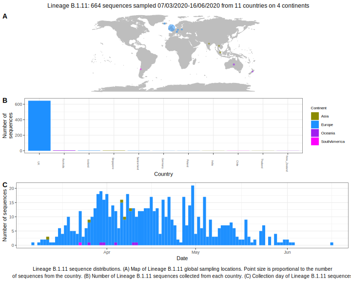

<ul class="actions small">
	 <a href="{{ 'lineages/lineage_B.1.html' | absolute_url }}" class="button special fit">Go to parent lineage: B.1</a>
</ul>

<h3> Lineage summaries</h3>

| Lineage name | Most common countries | Date range | Number of taxa | Known Travel | Recall value |
|:-----|:-----|:-------|-------:|-------:|:---------|--------:|
| <a href="{{ 'lineages/lineage_B.1.11.html' | absolute_url }}">B.1.11</a> | UK (98%), Australia (1%), Singapore (0%) | March 11 to July 13 | 202 |  | 0.96 |

<h3>Lineage descriptions</h3>

| Lineage | Notes |
|:-----|:-----|
| <a href="{{ 'lineages/lineage_B.1.11.html' | absolute_url }}">B.1.11</a> | UK lineage, pruned down relative to previous release. A number of sequences previously assigned B.1.11 reassigned to B.1 and some reassigned to B.1.88.  |

