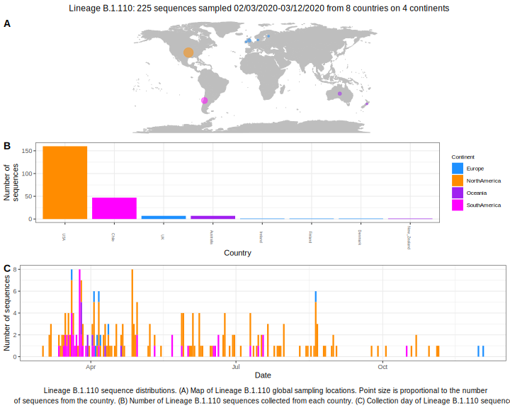

<ul class="actions small">
	 <a href="{{ 'lineages/lineage_B.1.1.1.html' | absolute_url }}" class="button special fit">Go to parent lineage: B.1</a>
</ul>

<h3> Lineage summaries</h3>

| Lineage name | Most common countries | Date range | Number of taxa |  Days since last sampling | Known Travel | Recall value |
|:-----|:-----|:-------|-------:|-------:|:---------|--------:|
| <a href="{{ 'lineages/lineage_B.1.110.html' | absolute_url }}">B.1.110</a> | USA (73%), Chile (20%), Australia (7%) | March 02 to June 30 | 55 | 53 |  | 0.98 |

<h3>Lineage descriptions</h3>

| Lineage | Notes |
|:-----|:-----|
| <a href="{{ 'lineages/lineage_B.1.110.html' | absolute_url }}">B.1.110</a> | Chilean/ US lineage |

