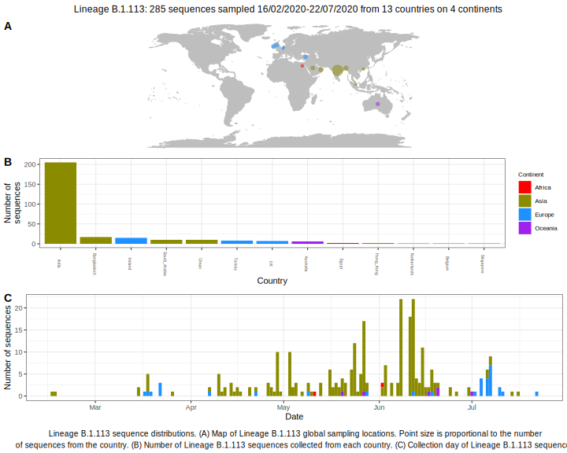

<ul class="actions small">
	 <a href="{{ 'lineages/lineage_B.1.html' | absolute_url }}" class="button special fit">Go to parent lineage: B.1</a>
</ul>

<h3> Lineage summaries</h3>

| Lineage name | Most common countries | Date range | Number of taxa |  Days since last sampling | Known Travel | Recall value |
|:-----|:-----|:-------|-------:|-------:|:---------|--------:|
| <a href="{{ 'lineages/lineage_B.1.113.html' | absolute_url }}">B.1.113</a> | India (78%), Saudi_Arabia (7%), Turkey (6%) | March 15 to June 08 | 111 | 14 | Saudia_Arabia to Turkey (3), Iran to Turkey (1) | 1.000 |

<h3>Lineage descriptions</h3>

| Lineage | Notes |
|:-----|:-----|
| <a href="{{ 'lineages/lineage_B.1.113.html' | absolute_url }}">B.1.113</a> | Indian lineage |

