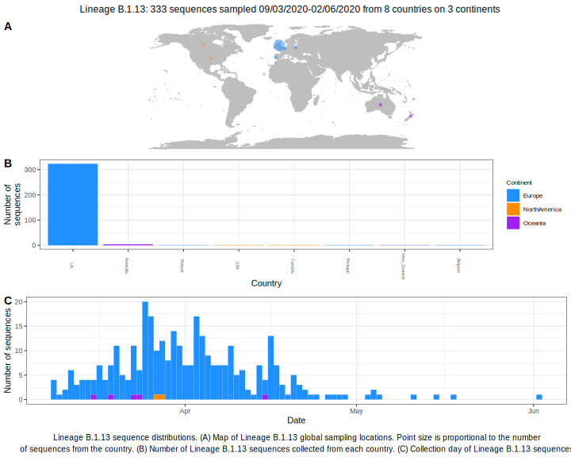

| Lineage | Notes |
|:-----|:-----|
| B.1.13 | England/ Australia, may need refining parent node BS=59, internal node of 100 |

<h2>Lineage B.1.13 composition summary </h2>

<strong>Total number of sequences:</strong> 248

| Lineage name | Most common countries | Date range | Number of taxa |  Days since last sampling | Known Travel | Recall value |
|:-----|:-----|:-------|-------:|-------:|:---------|--------:|
| B.1.13 | UK (95%), Australia (4%), Poland (0%) | March 09 to May 07 | 248 | 3 |  | 100.0 |
