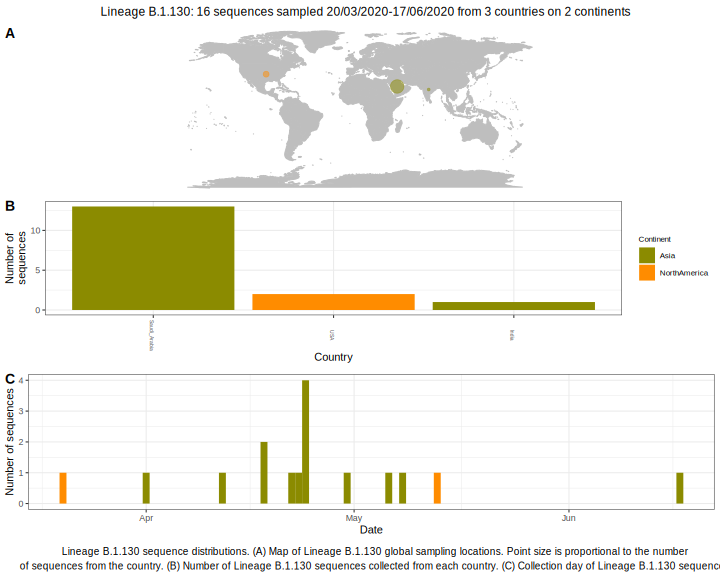

<ul class="actions small">
	 <a href="{{ 'lineages/lineage_B.1.1.1.html' | absolute_url }}" class="button special fit">Go to parent lineage: B.1</a>
</ul>

<h3> Lineage summaries</h3>

| Lineage name | Most common countries | Date range | Number of taxa |  Days since last sampling | Known Travel | Recall value |
|:-----|:-----|:-------|-------:|-------:|:---------|--------:|
| <a href="{{ 'lineages/lineage_B.1.130.html' | absolute_url }}">B.1.130</a> | Saudi_Arabia (81%), USA (12%), India (6%) | March 20 to June 17 | 16 | 66 |  | 0.33 |

<h3>Lineage descriptions</h3>

| Lineage | Notes |
|:-----|:-----|
| <a href="{{ 'lineages/lineage_B.1.130.html' | absolute_url }}">B.1.130</a> | Saudi Arabian lineage, some sequences had previously been assigned B.1.36. Possible that it may be reassigned B.1.36 again in future due to uncertainty in ML searching. |

