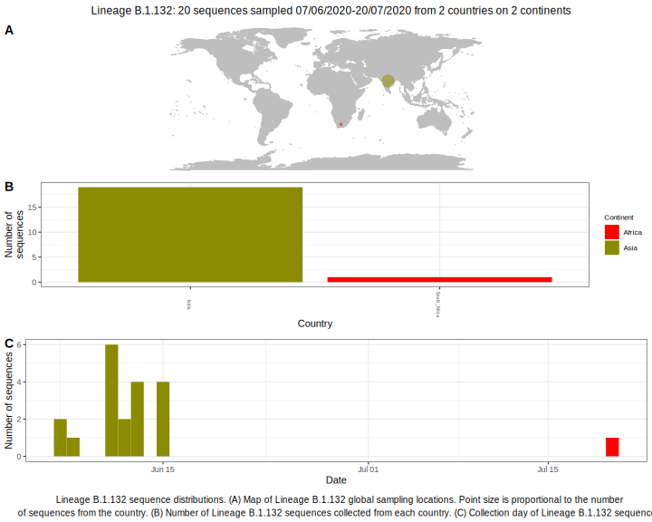

<ul class="actions small">
	 <a href="{{ 'lineages/lineage_B.1.html' | absolute_url }}" class="button special fit">Go to parent lineage: B.1</a>
</ul>

<h3> Lineage summaries</h3>

| Lineage name | Most common countries | Date range | Number of taxa |  Days since last sampling | Known Travel | Recall value |
|:-----|:-----|:-------|-------:|-------:|:---------|--------:|
| <a href="{{ 'lineages/lineage_B.1.132.html' | absolute_url }}">B.1.132</a> | India (95%), South_Africa (5%) | June 07 to July 20 | 20 |  | 0.35 |

<h3>Lineage descriptions</h3>

| Lineage | Notes |
|:-----|:-----|
| <a href="{{ 'lineages/lineage_B.1.132.html' | absolute_url }}">B.1.132</a> | Indian lineage, some sequences previously assigned B.1.36 & B.1.113. Possible that it may be reassigned B.1.36 again in future due to uncertainty in ML searching. |

