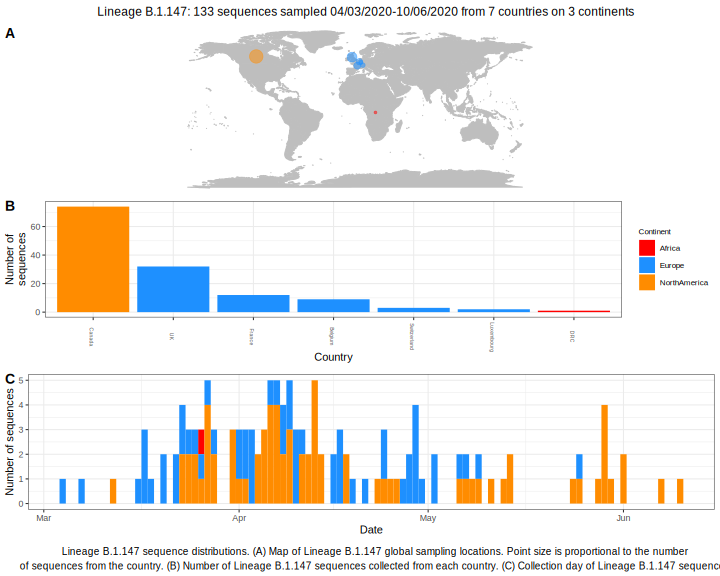

<ul class="actions small">
	 <a href="{{ 'lineages/lineage_B.1.html' | absolute_url }}" class="button special fit">Go to parent lineage: B.1</a>
</ul>

<h3> Lineage summaries</h3>

| Lineage name | Most common countries | Date range | Number of taxa | Known Travel | Recall value |
|:-----|:-----|:-------|-------:|-------:|:---------|--------:|
| <a href="{{ 'lineages/lineage_B.1.147.html' | absolute_url }}">B.1.147</a> | Canada (47%), UK (29%), Belgium (9%) | March 04 to June 30 | 104 |  | 0.4 |

<h3>Lineage descriptions</h3>

| Lineage | Notes |
|:-----|:-----|
| <a href="{{ 'lineages/lineage_B.1.147.html' | absolute_url }}">B.1.147</a> | Canadian lineage, with French, Belgian, DRC and English sequences |

