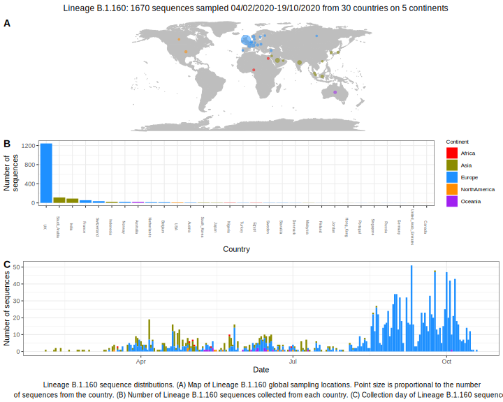

<ul class="actions small">
	 <a href="{{ 'lineages/lineage_B.1.html' | absolute_url }}" class="button special fit">Go to parent lineage: B.1</a>
</ul>

<h3> Lineage summaries</h3>

| Lineage name | Most common countries | Date range | Number of taxa | Known Travel | Recall value |
|:-----|:-----|:-------|-------:|-------:|:---------|--------:|
| <a href="{{ 'lineages/lineage_B.1.160.html' | absolute_url }}">B.1.160</a> | UK (72%), Saudi_Arabia (8%), India (6%) | February 04 to October 19 | 1464 |  | 0.3 |
| <a href="{{ 'lineages/lineage_B.1.160.1.html' | absolute_url }}">B.1.160.1</a> | UK (91%), Austria (3%), India (2%) | March 13 to September 11 | 206 |  | 0.47 |

<h3>Lineage descriptions</h3>

| Lineage | Notes |
|:-----|:-----|
| <a href="{{ 'lineages/lineage_B.1.160.html' | absolute_url }}">B.1.160</a> | Previously part of B.1.36: Tukey, India Saudi Arabia lineage (split in the most recent phylogeny) |
| <a href="{{ 'lineages/lineage_B.1.160.1.html' | absolute_url }}">B.1.160.1</a> | English lineage nested in diversity of B.1.160 |

