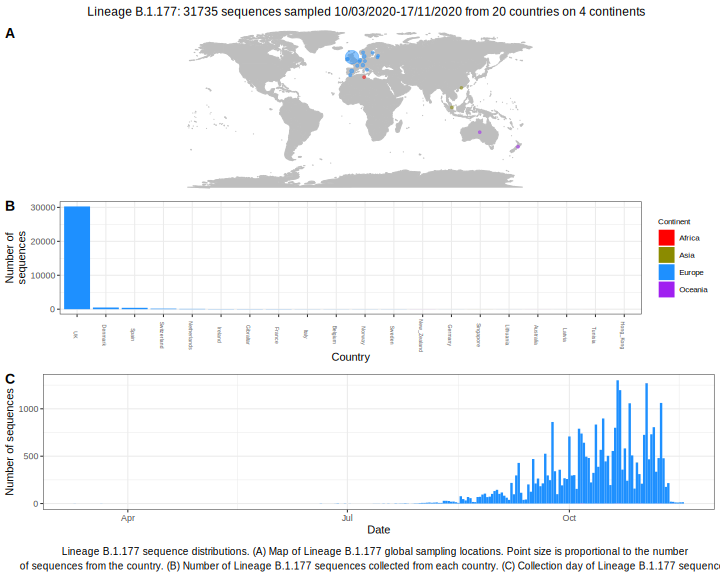

<ul class="actions small">
	 <a href="{{ 'lineages/lineage_B.1.html' | absolute_url }}" class="button special fit">Go to parent lineage: B.1</a>
</ul>

<h3> Lineage summaries</h3>

| Lineage name | Most common countries | Date range | Number of taxa | Known Travel | Recall value |
|:-----|:-----|:-------|-------:|-------:|:---------|--------:|
| <a href="{{ 'lineages/lineage_B.1.177.html' | absolute_url }}">B.1.177</a> | UK (98%), Spain (1%), Switzerland (1%) | June 20 to October 21 | 11001 |  | 1.0 |

<h3>Lineage descriptions</h3>

| Lineage | Notes |
|:-----|:-----|
| <a href="{{ 'lineages/lineage_B.1.177.html' | absolute_url }}">B.1.177</a> | Lineage originating in Spain and has become widespread. Three SNPs define this lineage C22227T, C28932T and G29645T. Equates to the 20A.EU1 cluster in Hodcroft et al 2020. |

